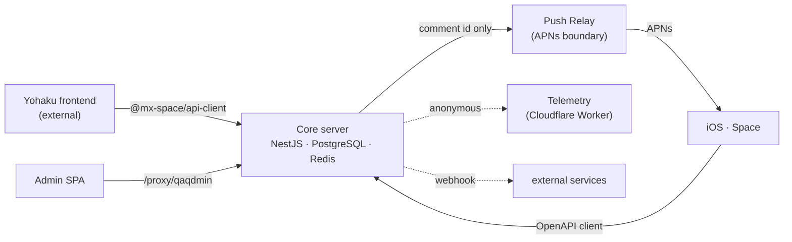

<p align="center">
  
</p>

<h1 align="center">Mix Space</h1>

<p align="center">
  Monorepo for the Mix Space personal-CMS stack — the core server, admin dashboard,
  native iOS client, privacy-preserving push relay, telemetry, and the shared SDKs
  that bind them.
</p>

<p align="center">
  <a href="https://github.com/mx-space/core/releases"></a>
  <a href="https://github.com/mx-space/core/actions/workflows/ci.yml"></a>
  <a href="./LICENSE"></a>
  <a href="https://nodejs.org"></a>
  <a href="https://hub.docker.com/r/innei/mx-server"></a>
  <a href="https://t.me/+lRRxARqVZC1mYTc9"></a>
</p>

---

## Overview

Mix Space is an AI-powered, headless CMS for personal blogs, creator homepages, and
content websites. This repository is the **workspace** that builds the entire
stack — it grew out of the core server and now ships the backend, the admin UI, a
native mobile client, an independent push relay, and the packages every client
shares.



## Apps

| Path | Package | What it is |
|------|---------|------------|
| [`apps/core`](./apps/core) | `@mx-space/core` | The heart of the stack — AI-powered headless CMS server (NestJS + Fastify + PostgreSQL + Redis). |
| [`apps/admin`](./apps/admin) | `@mx-admin/admin` | React 19 admin dashboard SPA, built into the server and served at `/proxy/qaqdmin`. |
| [`apps/ios`](./apps/ios) | Space | Native iOS admin client — UIKit shell with SwiftUI leaf screens (XcodeGen). |
| [`apps/push-relay`](./apps/push-relay) | `@mx-space/push-relay` | Independently deployable, privacy-preserving APNs relay. |
| [`apps/telemetry`](./apps/telemetry) | `@mx-space/telemetry` | Anonymous instance-telemetry collector (Cloudflare Worker + D1). |

## Packages

| Path | Package | What it is |
|------|---------|------------|
| [`packages/api-client`](./packages/api-client) | `@mx-space/api-client` | Typed SDK for frontends and third-party clients. |
| [`packages/cli`](./packages/cli) | `@mx-space/cli` (`mxs`) | Owner-side CLI for content + config (Effect-TS, OIDC device auth). |
| [`packages/db-schema`](./packages/db-schema) | `@mx-space/db-schema` | Shared Drizzle schema + Snowflake utilities (private). |
| [`packages/editor`](./packages/editor) | `@mx-space/editor` | Lexical editor contracts and projection utilities. |
| [`packages/ai`](./packages/ai) | `@mx-space/ai` | Shared AI contracts (SSE event unions) for server and clients. |
| [`packages/push-protocol`](./packages/push-protocol) | `@mx-space/push-protocol` | Versioned protocol shared by mx-core and Push Relay. |
| [`packages/webhook`](./packages/webhook) | `@mx-space/webhook` | Signature-verified webhook handler SDK. |
| [`packages/mongo-pg-cli`](./packages/mongo-pg-cli) | `@mx-space/mongo-pg-cli` | One-shot v11→v12 (MongoDB→PostgreSQL) data migration. |
| [`packages/e2e`](./packages/e2e) | — | End-to-end test suite (Vitest + testcontainers). |

## Layout

```
mx-core/
├── apps/
│   ├── core/        # NestJS server
│   ├── admin/       # React 19 admin SPA
│   ├── ios/         # native iOS client (XcodeGen)
│   ├── push-relay/  # independent APNs relay
│   └── telemetry/   # telemetry collector (CF Worker)
├── packages/        # shared SDKs, schema, editor & AI contracts, CLI, tests
├── docker-compose.yml        # dev stack (PostgreSQL + Redis + mx-migrate)
├── docker-compose.server.yml # production deployment template
└── dockerfile                # multi-stage production build
```

## Quick Start

```bash
corepack enable
pnpm install

# Start PostgreSQL + Redis (via Docker)
docker compose up -d postgres redis

# Core dev server → http://localhost:2333
pnpm dev

# Admin SPA dev server → http://localhost:9528 (run alongside core)
pnpm dev:admin
```

> Per-app setup, deployment, and operational docs live in each app's own README —
> start at [`apps/core`](./apps/core) for the server.

## Commands

Run from the repo root:

| Command | Effect |
|---------|--------|
| `pnpm dev` | Core dev server (watch mode) |
| `pnpm dev:admin` | Admin SPA dev server |
| `pnpm build` | Build the core application |
| `pnpm bundle` | Production bundle (Vite) |
| `pnpm test` | Core test suite (Vitest) |
| `pnpm e2e` | End-to-end suite |
| `pnpm typecheck` | Core typecheck + controller/validate guards |
| `pnpm lint` / `pnpm format` | ESLint / Prettier |

## Conventions

- **Response envelope** — success: `{ data, meta? }`; error: `{ error: { code, message, details? } }`. Code is camelCase end-to-end; the wire format is snake_case. Full detail in the [core README](./apps/core#api-response-format).
- **Migrations** — forward SQL migrations run as a one-shot release-phase step, never on boot. Historical MongoDB → PostgreSQL data lives in `packages/mongo-pg-cli`. Upgrade notes: [core README · Upgrading](./apps/core#upgrading).

## Related Projects

| Project | Description |
|---------|-------------|
| [Yohaku](https://github.com/Innei/Yohaku) | Next.js frontend (recommended) |
| [Shiro](https://github.com/innei/shiro) | Minimalist frontend |
| [Kami](https://github.com/mx-space/kami) | Anime-flavored frontend (legacy) |
| [@haklex/rich-headless](https://github.com/innei/haklex) | Lexical editor (server-side) |

## License

[AGPLv3 + MIT](./LICENSE) — see [`ADDITIONAL_TERMS.md`](./ADDITIONAL_TERMS.md).
