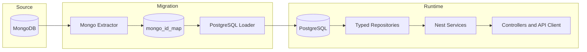
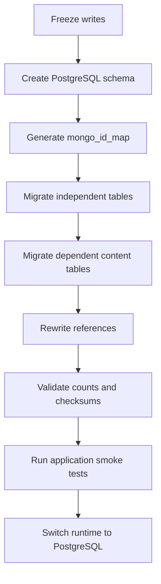

# PostgreSQL + Snowflake Database Migration - Design Spec

Date: 2026-05-02
Status: Draft
Author: Codex

## 1. Overview

MX Space Core currently persists application data through MongoDB, Mongoose, and Typegoose. The migration target is PostgreSQL with a type-safe repository layer and Snowflake IDs as the canonical identity model.

The migration is a hard database cutover. MongoDB remains only as the source for the one-time migration tool and as historical backup input. After cutover, application runtime code must not depend on MongoDB, Mongoose, Typegoose, Mongo ObjectId, `mongodump`, or `mongorestore`.

## 2. Motivation

| Problem | Current Cause | Target Outcome |
|---|---|---|
| Weak type guarantees | MongoDB document shape is flexible and Mongoose typing is not authoritative enough at business boundaries. | PostgreSQL schema and repository DTOs become the source of truth. |
| Difficult structural migration | Historical Mongo migrations mutate loosely typed documents and require defensive runtime checks. | Schema changes are explicit SQL migrations with typed data transforms. |
| Mixed ID semantics | Business code still handles `_id`, `id`, ObjectId instances, and 24-hex strings. | A single canonical `id` contract is used: Snowflake decimal string externally, PostgreSQL `bigint` internally. |
| Implicit data loading | `populate`, `autopopulate`, `lean`, and plugin transforms hide query behavior. | All joins and projections are explicit repository methods. |
| Tooling lock-in | Auth, backup, migrations, tests, and init checks are Mongo-specific. | Runtime operations use PostgreSQL-native tools and test fixtures. |

## 3. Goals and Non-goals

### Goals

- Replace MongoDB runtime storage with PostgreSQL.
- Replace Mongoose/Typegoose model access with explicit repository classes.
- Replace ObjectId with Snowflake IDs for all first-class application entities.
- Preserve public API shape where practical: response IDs remain strings.
- Provide a deterministic one-time MongoDB-to-PostgreSQL migration path.
- Keep Redis, object storage, AI runtime, and HTTP API semantics outside the migration unless directly database-coupled.
- Use behavior-oriented regression tests for externally meaningful behavior.

### Non-goals

- No MongoDB/PostgreSQL dual-write compatibility window in the first implementation.
- No attempt to preserve Mongo `_id` as a public or domain identifier.
- No broad API redesign beyond ID validation and database-coupled response normalization.
- No implementation-snapshot tests that merely freeze schema object literals or repository method inventories.
- No full-text-search product redesign in the first cutover; retain the existing `search_documents` concept first.

## 4. Current State Inventory

| Area | Current File(s) | Migration Implication |
|---|---|---|
| Connection | `apps/core/src/utils/database.util.ts` | Replace `getDatabaseConnection()` with PostgreSQL pool/client initialization. |
| Provider registry | `apps/core/src/processors/database/database.models.ts` | Replace Typegoose provider list with repository providers. |
| Model transformer | `apps/core/src/transformers/model.transformer.ts` | Remove `InjectModel` and `getModelForClass`; introduce repository injection tokens. |
| Base model | `apps/core/src/shared/model/base.model.ts` | Replace Mongoose plugin semantics with explicit `created` and ID mapping. |
| DTO validation | `apps/core/src/common/zod/primitives.ts`, `apps/core/src/shared/dto/id.dto.ts` | Replace `zMongoId`/`MongoIdDto` with Snowflake entity ID validators. |
| Auth | `apps/core/src/modules/auth/auth.implement.ts`, `apps/core/src/modules/auth/auth.service.ts` | Replace Better Auth Mongo adapter and raw Mongo collection access. |
| Migration runner | `apps/core/src/migration/migrate.ts` | Replace Mongo migration history and lock collection with SQL migration table and advisory lock. |
| Backup/restore | `apps/core/src/modules/backup/backup.service.ts` | Replace `mongodump`/`mongorestore` with `pg_dump`/`pg_restore` or SQL archive flow. |
| Tests | `apps/core/test/helper/db-mock.helper.ts`, `apps/core/vitest.config.mts` | Replace `mongodb-memory-server` with PostgreSQL test service or testcontainers. |

## 5. Architecture



### Target Runtime Boundaries

| Boundary | Rule |
|---|---|
| Database | PostgreSQL stores IDs as `bigint`. |
| Repository | Repositories convert Snowflake `bigint` to string before returning domain objects. |
| Service | Services consume `EntityId` strings and never construct SQL fragments directly. |
| Controller | Controllers validate decimal Snowflake strings with `zEntityId`. |
| API client | Generated or handwritten models continue to expose `id: string`. |
| Migration | Mongo ObjectIds are accepted only in migration input and `mongo_id_map`. |

## 6. Technology Selection

| Component | Decision | Rationale |
|---|---|---|
| Database | PostgreSQL 16+ | Mature relational constraints, `jsonb`, generated indexes, advisory locks, `pg_dump`. |
| Query layer | Drizzle ORM + `pg` | TypeScript-first SQL modeling without hiding SQL semantics behind document-like APIs. |
| Migrations | Drizzle SQL migrations plus custom data migrations | Schema migrations and data transformations have different failure modes and should be separated. |
| IDs | Snowflake `bigint`, serialized as string | Time-sortable, compact, non-ObjectId, globally generatable across clustered workers. |
| Tests | PostgreSQL test database | Database behavior must be validated against real SQL semantics. |

If Better Auth adapter support changes during implementation, the implementation phase must verify the exact supported PostgreSQL/Drizzle adapter. If a suitable adapter is unavailable, implement the Better Auth adapter contract against the same PostgreSQL pool rather than retaining MongoDB.

## 7. Snowflake Identity Model

### Canonical Contract

| Layer | Representation | Constraint |
|---|---|---|
| PostgreSQL primary key | `bigint` | Positive signed 64-bit integer. |
| PostgreSQL foreign key | `bigint` | References first-class table IDs where practical. |
| Polymorphic reference | `ref_type text`, `ref_id bigint` | Validated by repository/service logic. |
| TypeScript domain | `EntityId` branded string | Decimal string only; never JavaScript `number`. |
| JSON/API | string | Avoid precision loss beyond `Number.MAX_SAFE_INTEGER`. |

### Bit Layout

| Bits | Field | Notes |
|---:|---|---|
| 41 | Timestamp milliseconds | Offset from custom epoch. |
| 10 | Worker ID | Supports 1024 generator nodes. |
| 12 | Sequence | Supports 4096 IDs per millisecond per worker. |

Use a custom epoch such as `2026-05-02T00:00:00.000Z`. Keep the sign bit unused so every generated ID remains positive inside PostgreSQL `bigint`.

### Generator Rules

- `SnowflakeService.nextId()` returns `EntityId`.
- Internal arithmetic uses `bigint`.
- The service must reject unsafe numeric input at boundaries.
- Clustered production must provide a stable worker ID through configuration.
- Worker ID collisions are fatal; the process must fail fast.
- If the clock moves backwards, the generator must either wait until the last timestamp or throw a fatal startup/runtime error according to a documented policy.
- IDs generated during migration can use a dedicated migration worker ID range, for example `900-999`, to separate migration-generated rows from runtime rows.

### Proposed Files

| File | Responsibility |
|---|---|
| `apps/core/src/shared/id/entity-id.ts` | `EntityId` type, parser, serializer, zod validator. |
| `apps/core/src/shared/id/snowflake.service.ts` | Snowflake generator implementation. |
| `apps/core/src/shared/id/snowflake.spec.ts` | Monotonicity, uniqueness, serialization, and clock rollback behavior. |
| `apps/core/src/app.config.ts` | `SNOWFLAKE_WORKER_ID` and epoch configuration. |

## 8. PostgreSQL Schema Strategy

### Common Columns

Most first-class tables should share this baseline shape:

```sql
id bigint primary key,
created_at timestamptz not null default now()
```

Tables with update semantics add:

```sql
updated_at timestamptz
```

JSON-like application data should use `jsonb`, not stringified JSON.

### Collection-to-Table Mapping

| Mongo Collection | PostgreSQL Table | Notes |
|---|---|---|
| `categories` | `categories` | Preserve `type`, `name`, `slug`; unique indexes on `name` and `slug`. |
| `topics` | `topics` | Preserve `name`, `slug`, `description`, `introduce`, `icon` unless separately renamed. |
| `posts` | `posts` | `category_id bigint`; `tags text[]`; `meta jsonb`; `count` can be columns or embedded JSON depending on query needs. |
| `notes` | `notes` | Preserve `nid integer unique`; `topic_id bigint`; `coordinates jsonb` or typed columns. |
| `pages` | `pages` | Preserve slug/order/subtitle/content fields. |
| `comments` | `comments` | `ref_type text`, `ref_id bigint`, `parent_comment_id bigint`, `root_comment_id bigint`. |
| `drafts` | `drafts` | `ref_type text`, `ref_id bigint`; `history jsonb` or child table after query review. |
| `readers` | `readers` | Better Auth user table semantics must be aligned before final schema. |
| `owner_profiles` | `owner_profiles` | `reader_id bigint unique`; `social_ids jsonb`. |
| `accounts` | `accounts` | Better Auth account table; confirm adapter-required column names. |
| `sessions` | `sessions` | Better Auth session table; preserve provider extension. |
| `apikey` | `api_keys` or adapter table | Preserve legacy API key behavior and migration compatibility. |
| `ai_translations` | `ai_translations` | `ref_id bigint`; unique `(ref_id, ref_type, lang)`. |
| `translation_entries` | `translation_entries` | Unique `(key_path, lang, key_type, lookup_key)`. |
| `ai_summaries` | `ai_summaries` | `ref_id bigint`; index by `ref_id`. |
| `ai_insights` | `ai_insights` | `ref_id bigint`; unique `(ref_id, lang)`. |
| `search_documents` | `search_documents` | Preserve denormalized search cache first; future `tsvector` is separate. |
| `file_references` | `file_references` | `ref_id bigint`; status/ref indexes. |
| `activities` | `activities` | `payload jsonb`; consider generated columns only after query profiling. |
| `analyzes` | `analyzes` | `ua jsonb`; time-series indexes by `timestamp`. |
| `recentlies` | `recentlies` | `metadata jsonb`; polymorphic reference retained. |
| `serverless_storages` | `serverless_storages` | `value jsonb`; unique `(namespace, key)`. |
| `serverless_logs` | `serverless_logs` | `logs jsonb`, `error jsonb`; TTL becomes scheduled cleanup. |
| `webhooks` | `webhooks` | Secret columns remain non-selected at repository boundary. |
| `webhook_events` | `webhook_events` | `headers jsonb`, `payload jsonb`, `response jsonb/text`. |

### Target Schema Inventory

The following inventory is the minimum target schema set for the first PostgreSQL cutover. It intentionally lists the ID-bearing tables and relationship columns even when MongoDB currently stores the relationship without a constraint.

#### Core Content Tables

| Table | Minimum Columns | Keys and Indexes |
|---|---|---|
| `categories` | `id bigint pk`, `created_at timestamptz`, `name text not null`, `type integer not null default 0`, `slug text not null` | `unique(name)`, `unique(slug)`, index `slug`. |
| `topics` | `id bigint pk`, `created_at timestamptz`, `description text default ''`, `introduce text`, `name text not null`, `slug text not null`, `icon text` | `unique(name)`, `unique(slug)`. |
| `posts` | `id bigint pk`, `created_at timestamptz`, `title text not null`, `text text`, `content_format text not null`, `content text`, `images jsonb`, `modified_at timestamptz`, `meta jsonb`, `slug text not null`, `summary text`, `category_id bigint not null`, `copyright boolean`, `is_published boolean`, `tags text[]`, `read_count integer not null default 0`, `like_count integer not null default 0`, `pin_at timestamptz`, `pin_order integer` | `unique(slug)`, index `modified_at`, index `created_at`, FK `category_id -> categories.id on delete restrict`. |
| `post_related_posts` | `post_id bigint not null`, `related_post_id bigint not null`, `position integer default 0` | Primary key `(post_id, related_post_id)`, FK both columns to `posts.id on delete cascade`. |
| `notes` | `id bigint pk`, `created_at timestamptz`, `title text`, `text text`, `content_format text not null`, `content text`, `images jsonb`, `modified_at timestamptz`, `meta jsonb`, `nid integer not null`, `slug text`, `is_published boolean`, `password text`, `public_at timestamptz`, `mood text`, `weather text`, `bookmark boolean`, `coordinates jsonb`, `location text`, `read_count integer not null default 0`, `like_count integer not null default 0`, `topic_id bigint` | `unique(nid)`, `unique(slug) where slug is not null`, index `nid desc`, index `modified_at`, FK `topic_id -> topics.id on delete set null`. |
| `pages` | `id bigint pk`, `created_at timestamptz`, `title text not null`, `text text`, `content_format text not null`, `content text`, `images jsonb`, `modified_at timestamptz`, `meta jsonb`, `slug text not null`, `subtitle text`, `order integer not null default 1` | `unique(slug)`, index `order`. |
| `recentlies` | `id bigint pk`, `created_at timestamptz`, `comments_index integer default 0`, `allow_comment boolean default true`, `content text not null default ''`, `type text not null`, `metadata jsonb`, `ref_type text`, `ref_id bigint`, `modified_at timestamptz`, `up integer default 0`, `down integer default 0` | Index `(ref_type, ref_id)`, index `created_at`. Polymorphic ref is validated by repository code. |
| `comments` | `id bigint pk`, `created_at timestamptz`, `ref_type text not null`, `ref_id bigint not null`, `author text`, `mail text`, `url text`, `text text not null`, `state integer default 0`, `parent_comment_id bigint`, `root_comment_id bigint`, `reply_count integer default 0`, `latest_reply_at timestamptz`, `is_deleted boolean default false`, `deleted_at timestamptz`, `ip text`, `agent text`, `pin boolean default false`, `location text`, `is_whispers boolean default false`, `avatar text`, `auth_provider text`, `meta text`, `reader_id bigint`, `edited_at timestamptz`, `anchor jsonb` | Index `(ref_type, ref_id, parent_comment_id, pin, created_at)`, index `(root_comment_id, created_at)`, FK parent/root to `comments.id on delete cascade`, FK `reader_id -> readers.id on delete set null`, polymorphic content ref validated by repository code. |
| `drafts` | `id bigint pk`, `created_at timestamptz`, `updated_at timestamptz`, `ref_type text not null`, `ref_id bigint`, `title text not null default ''`, `text text not null default ''`, `content_format text not null`, `content text`, `images jsonb`, `meta jsonb`, `type_specific_data jsonb`, `version integer not null default 1`, `published_version integer` | Index `(ref_type, ref_id) where ref_id is not null`, index `updated_at`, polymorphic content ref validated by repository code. |
| `draft_histories` | `id bigint pk`, `draft_id bigint not null`, `version integer not null`, `title text not null`, `text text`, `content_format text not null`, `content text`, `type_specific_data jsonb`, `saved_at timestamptz not null`, `is_full_snapshot boolean not null`, `ref_version integer`, `base_version integer` | `unique(draft_id, version)`, FK `draft_id -> drafts.id on delete cascade`. |

#### Identity and Auth Tables

| Table | Minimum Columns | Keys and Indexes |
|---|---|---|
| `readers` | `id bigint pk`, `created_at timestamptz`, `updated_at timestamptz`, `email text`, `email_verified boolean`, `name text`, `handle text`, `username text`, `display_username text`, `image text`, `role text not null default 'reader'` | `unique(email) where email is not null`, `unique(username) where username is not null`, index `role`. |
| `owner_profiles` | `id bigint pk`, `created_at timestamptz`, `reader_id bigint not null`, `mail text`, `url text`, `introduce text`, `last_login_ip text`, `last_login_time timestamptz`, `social_ids jsonb` | `unique(reader_id)`, FK `reader_id -> readers.id on delete cascade`. |
| `accounts` | `id bigint pk`, `created_at timestamptz`, `updated_at timestamptz`, `user_id bigint not null`, `account_id text`, `provider_id text not null`, `provider_account_id text`, `password text`, `type text`, `access_token text`, `refresh_token text`, `expires_at timestamptz`, `raw jsonb` | FK `user_id -> readers.id on delete cascade`, unique adapter key after Better Auth schema validation. |
| `sessions` | `id bigint pk`, `created_at timestamptz`, `updated_at timestamptz`, `user_id bigint not null`, `token text not null`, `expires_at timestamptz`, `ip_address text`, `user_agent text`, `provider text` | `unique(token)`, FK `user_id -> readers.id on delete cascade`. |
| `api_keys` | `id bigint pk`, `created_at timestamptz`, `updated_at timestamptz`, `user_id bigint`, `reference_id bigint`, `config_id text`, `name text`, `key text not null`, `start text`, `prefix text`, `enabled boolean`, `rate_limit_enabled boolean`, `request_count integer`, `expires_at timestamptz` | `unique(key)`, FK `user_id -> readers.id on delete cascade`, FK `reference_id -> readers.id on delete cascade`. |
| `passkeys` | `id bigint pk`, `created_at timestamptz`, `updated_at timestamptz`, `user_id bigint not null`, `credential_id text not null`, `public_key text not null`, `counter integer`, `device_type text`, `backed_up boolean`, `transports text[]` | `unique(credential_id)`, FK `user_id -> readers.id on delete cascade`. |

Better Auth owns exact adapter column requirements. The migration must verify adapter-generated schema names before implementation, but all user/account/session/API-key relationships must resolve to Snowflake reader IDs.

#### AI, Search, and Translation Tables

| Table | Minimum Columns | Keys and Indexes |
|---|---|---|
| `ai_translations` | `id bigint pk`, `created_at timestamptz`, `hash text not null`, `ref_id bigint not null`, `ref_type text not null`, `lang text not null`, `source_lang text not null`, `title text not null`, `text text not null`, `subtitle text`, `summary text`, `tags text[]`, `source_modified_at timestamptz`, `ai_model text`, `ai_provider text`, `content_format text`, `content text`, `source_block_snapshots jsonb`, `source_meta_hashes jsonb` | `unique(ref_id, ref_type, lang)`, index `ref_id`; polymorphic ref validated by repository code. |
| `translation_entries` | `id bigint pk`, `created_at timestamptz`, `key_path text not null`, `lang text not null`, `key_type text not null`, `lookup_key text not null`, `source_text text not null`, `translated_text text not null`, `source_updated_at timestamptz` | `unique(key_path, lang, key_type, lookup_key)`, index `(key_path, lang)`, index `lookup_key`. |
| `ai_summaries` | `id bigint pk`, `created_at timestamptz`, `hash text not null`, `summary text not null`, `ref_id bigint not null`, `lang text` | Index `ref_id`; polymorphic ref validated by repository code. |
| `ai_insights` | `id bigint pk`, `created_at timestamptz`, `ref_id bigint not null`, `lang text not null`, `hash text not null`, `content text not null`, `is_translation boolean default false`, `source_insights_id bigint`, `source_lang text`, `model_info jsonb` | `unique(ref_id, lang)`, FK `source_insights_id -> ai_insights.id on delete set null`, polymorphic ref validated by repository code. |
| `ai_agent_conversations` | `id bigint pk`, `created_at timestamptz`, `updated_at timestamptz`, `ref_id bigint not null`, `ref_type text not null`, `title text`, `messages jsonb not null`, `model text not null`, `provider_id text not null`, `review_state jsonb`, `diff_state jsonb`, `message_count integer default 0` | Index `(ref_id, ref_type)`, index `updated_at`; polymorphic ref validated by repository code. |
| `search_documents` | `id bigint pk`, `ref_type text not null`, `ref_id bigint not null`, `title text not null`, `search_text text not null`, `terms text[] not null default '{}'`, `title_term_freq jsonb not null default '{}'`, `body_term_freq jsonb not null default '{}'`, `title_length integer default 0`, `body_length integer default 0`, `slug text`, `nid integer`, `is_published boolean default true`, `public_at timestamptz`, `has_password boolean default false`, `created_at timestamptz`, `modified_at timestamptz` | `unique(ref_type, ref_id)`, indexes matching current filters; optional future `tsvector` index is out of first cutover. |

#### Operational Tables

| Table | Minimum Columns | Keys and Indexes |
|---|---|---|
| `options` | `id bigint pk`, `name text not null`, `value jsonb` | `unique(name)`. |
| `activities` | `id bigint pk`, `created_at timestamptz`, `type integer`, `payload jsonb` | Index `created_at`, optional generated indexes after query profiling. |
| `analyzes` | `id bigint pk`, `timestamp timestamptz not null`, `ip text`, `ua jsonb`, `country text`, `path text`, `referer text` | Index `timestamp`, `(timestamp, path)`, `(timestamp, referer)`, `(timestamp, ip)`. |
| `links` | `id bigint pk`, `created_at timestamptz`, `name text not null`, `url text not null`, `avatar text`, `description text`, `type integer`, `state integer`, `email text` | `unique(name)`, `unique(url)`. |
| `projects` | `id bigint pk`, `created_at timestamptz`, `name text not null`, `preview_url text`, `doc_url text`, `project_url text`, `images text[]`, `description text not null`, `avatar text`, `text text` | `unique(name)`. |
| `says` | `id bigint pk`, `created_at timestamptz`, `text text not null`, `source text`, `author text` | Index `created_at`. |
| `snippets` | `id bigint pk`, `created_at timestamptz`, `updated_at timestamptz`, `type text`, `private boolean`, `raw text not null`, `name text not null`, `reference text not null default 'root'`, `comment text`, `metatype text`, `schema text`, `method text`, `custom_path text`, `secret text`, `enable boolean`, `built_in boolean`, `compiled_code text` | Index `(name, reference)`, index `type`, `unique(custom_path) where custom_path is not null`. |
| `subscribes` | `id bigint pk`, `created_at timestamptz`, `email text not null`, `cancel_token text not null`, `subscribe integer not null`, `verified boolean default false` | `unique(email)`, `unique(cancel_token)`. |
| `file_references` | `id bigint pk`, `created_at timestamptz`, `file_url text not null`, `file_name text not null`, `status text not null`, `ref_id bigint`, `ref_type text`, `s3_object_key text` | Index `file_url`, `(ref_id, ref_type)`, `(status, created_at)`; polymorphic ref validated by repository code because delete may set pending rather than cascade. |
| `poll_votes` | `id bigint pk`, `created_at timestamptz`, `poll_id text not null`, `voter_fingerprint text not null` | `unique(poll_id, voter_fingerprint)`, index `poll_id`. |
| `poll_vote_options` | `vote_id bigint not null`, `option_id text not null` | Primary key `(vote_id, option_id)`, FK `vote_id -> poll_votes.id on delete cascade`, index `option_id`. |
| `slug_trackers` | `id bigint pk`, `slug text not null`, `type text not null`, `target_id bigint not null` | Index `(type, target_id)`, optional `unique(slug, type)` if implementation confirms no duplicate history requirement. |
| `serverless_storages` | `id bigint pk`, `namespace text not null`, `key text not null`, `value jsonb not null` | `unique(namespace, key)`. |
| `serverless_logs` | `id bigint pk`, `created_at timestamptz`, `function_id bigint`, `reference text not null`, `name text not null`, `method text`, `ip text`, `status text not null`, `execution_time integer not null`, `logs jsonb`, `error jsonb` | Index `created_at`, `(function_id, created_at)`, `(reference, name, created_at)`; TTL becomes scheduled cleanup. |
| `webhooks` | `id bigint pk`, `timestamp timestamptz`, `payload_url text not null`, `events text[] not null`, `enabled boolean not null`, `secret text not null`, `scope integer` | Index `enabled`. |
| `webhook_events` | `id bigint pk`, `timestamp timestamptz`, `headers jsonb`, `payload jsonb`, `event text`, `response jsonb`, `success boolean`, `hook_id bigint not null`, `status integer default 0` | FK `hook_id -> webhooks.id on delete cascade`, index `hook_id`, index `timestamp`. |

### ID Relationship Matrix

| Relationship | PostgreSQL Constraint | Delete Policy |
|---|---|---|
| `posts.category_id -> categories.id` | Direct FK | `on delete restrict`; category deletion no longer needs manual post-count guard. |
| `post_related_posts.post_id -> posts.id` | Direct FK | `on delete cascade`. |
| `post_related_posts.related_post_id -> posts.id` | Direct FK | `on delete cascade`. |
| `notes.topic_id -> topics.id` | Direct FK | `on delete set null`; topic deletion keeps notes readable. |
| `comments.parent_comment_id -> comments.id` | Direct self FK | `on delete cascade`. |
| `comments.root_comment_id -> comments.id` | Direct self FK | `on delete cascade`. |
| `comments.reader_id -> readers.id` | Direct FK | `on delete set null`; historical comments remain. |
| `owner_profiles.reader_id -> readers.id` | Direct FK | `on delete cascade`. |
| `accounts.user_id -> readers.id` | Direct FK | `on delete cascade`. |
| `sessions.user_id -> readers.id` | Direct FK | `on delete cascade`. |
| `api_keys.user_id/reference_id -> readers.id` | Direct FK | `on delete cascade`. |
| `passkeys.user_id -> readers.id` | Direct FK | `on delete cascade`. |
| `draft_histories.draft_id -> drafts.id` | Direct FK | `on delete cascade`. |
| `ai_insights.source_insights_id -> ai_insights.id` | Direct self FK | `on delete set null`. |
| `poll_vote_options.vote_id -> poll_votes.id` | Direct FK | `on delete cascade`. |
| `webhook_events.hook_id -> webhooks.id` | Direct FK | `on delete cascade`. |
| `comments/ref_id`, `drafts/ref_id`, `recentlies/ref_id`, `search_documents/ref_id`, `ai_* ref_id`, `file_references/ref_id`, `slug_trackers.target_id`, `ai_agent_conversations.ref_id` | Polymorphic relationship | Validate through repository and migration reports; use cascade only through explicit service methods or table-specific triggers if later justified. |

### Deletion and Constraint Policy

PostgreSQL constraints should replace business-code checks where the relationship is direct and the desired behavior is unambiguous.

| Existing Mongo Pattern | PostgreSQL Improvement |
|---|---|
| Check whether a category has posts before deletion. | FK `posts.category_id -> categories.id on delete restrict` lets the database reject invalid deletion. |
| Delete child rows manually after deleting a webhook, draft, poll vote, or related-post edge. | `on delete cascade` handles dependent rows. |
| Clear owner profile, accounts, sessions, API keys, and passkeys manually after deleting a reader. | Auth-related FKs cascade from `readers.id`. |
| Delete comment replies and maintain thread integrity in application code. | Self-referential FKs maintain parent/root validity; transaction code still updates counters. |
| Remove or reset file references on article deletion. | Keep explicit service logic because the desired behavior is stateful: references may become pending instead of being deleted. |

Constraint use must remain semantic. Do not add cascade merely to reduce code if the domain expects data preservation, auditability, or state transitions.

### Transaction Policy

The first schema cutover should identify transaction boundaries even if full transaction refactoring happens later.

| Business Operation | Required Transaction Boundary |
|---|---|
| Create owner by credential | Insert reader, account, and owner profile atomically. |
| Transfer owner role | Demote previous owner and promote target reader atomically; enforce exactly one owner after commit. |
| Create/update post | Validate category, write post, update related posts, update draft published state, and emit post-write side effects after commit. |
| Delete post/note/page | Delete or detach dependent drafts, comments, AI rows, search documents, file references, and activity records according to table policy. |
| Save draft with history | Update draft row and insert draft history row atomically. |
| Create comment reply | Insert comment, update root/parent counters, and update target comment index atomically. |
| Create API key | Insert adapter row and legacy compatibility fields atomically. |
| Dispatch webhook | Persist webhook event and update dispatch status atomically where retry state depends on the row. |

Repository methods should accept an optional transaction handle so services can compose multi-table writes without opening nested transactions.

### Nested Model Conversion Policy

Mongo nested models and `Mixed` fields must be classified before migration. The target is not to flatten everything; the target is to make queryable relationships relational and keep value objects as typed JSON or structured columns.

| Current Nested Shape | Target Shape | Rationale |
|---|---|---|
| `CountModel` on posts/notes | `read_count`, `like_count` columns | Frequently aggregated and sorted. |
| `ImageModel[]` on posts/notes/pages/drafts | `images jsonb` | Value object, not independently referenced. |
| `WriteBaseModel.meta` and `DraftModel.meta` | `meta jsonb` | User-defined metadata; avoid heuristic ObjectId rewriting inside arbitrary JSON. |
| `Coordinate` on notes | `coordinates jsonb` initially | Value object; can become latitude/longitude columns if geo queries are added. |
| `CommentAnchorModel` | `anchor jsonb` | Structured value object tied to one comment. |
| `DraftHistoryModel[]` | `draft_histories` table | Versioned repeating data with identity and growth risk. |
| `MetaFieldOption[]` and `MetaPresetChild[]` | `jsonb` columns | Configuration value objects; no independent lifecycle. |
| `AIAgentConversation.messages` | `messages jsonb` | External rich-agent message format should remain verbatim. |
| `AITranslation.sourceBlockSnapshots` and `sourceMetaHashes` | `jsonb` | Audit/debug metadata, not relational query surface. |
| `ServerlessStorage.value`, `ServerlessLog.logs`, `ServerlessLog.error` | `jsonb` | Arbitrary user/runtime payloads. |
| `WebhookEvent.headers`, `payload`, `response` | `jsonb` | Structured event payloads; easier to inspect than stringified JSON. |
| `PollVote.optionIds` | `poll_vote_options` child table | SQL tallying becomes a simple `group by option_id`. |

During data migration, ID rewriting must be schema-aware. Known relationship fields are rewritten through `mongo_id_map`; arbitrary JSON fields are not traversed for ObjectId-looking strings unless the target field is explicitly listed as a relationship.

### Migration Metadata Tables

```sql
create table schema_migrations (
  name text primary key,
  applied_at timestamptz not null default now()
);

create table mongo_id_map (
  collection text not null,
  mongo_id text not null,
  snowflake_id bigint not null,
  primary key (collection, mongo_id),
  unique (snowflake_id)
);

create table data_migration_runs (
  id bigint primary key,
  name text not null,
  started_at timestamptz not null,
  finished_at timestamptz,
  status text not null,
  error text
);
```

## 9. Repository Layer

### Repository Principles

- A repository method returns domain objects with `id: EntityId`, not database rows.
- Repository inputs accept `EntityId`, not `bigint`.
- SQL joins replace `populate` and `autopopulate`.
- Pagination returns the existing public pagination shape.
- Repository methods are named by behavior, not by Mongo equivalents.

### Initial Repository Files

| File | Responsibility |
|---|---|
| `apps/core/src/processors/database/postgres.provider.ts` | PostgreSQL pool and Drizzle database provider. |
| `apps/core/src/processors/database/repository.tokens.ts` | Injection tokens for repositories. |
| `apps/core/src/modules/post/post.repository.ts` | Post CRUD, slug lookup, category join, related posts. |
| `apps/core/src/modules/note/note.repository.ts` | Note CRUD, `nid` lookup, topic join, visibility filters. |
| `apps/core/src/modules/page/page.repository.ts` | Page CRUD and ordering. |
| `apps/core/src/modules/comment/comment.repository.ts` | Comment threads, reply counts, anchor operations. |
| `apps/core/src/modules/auth/auth.repository.ts` | Reader, account, owner profile, API key queries. |
| `apps/core/src/modules/search/search.repository.ts` | Search document indexing and lookup. |

## 10. Query Rewrite Rules

| Mongo/Mongoose Pattern | PostgreSQL Replacement |
|---|---|
| `findById(id)` | `where(eq(table.id, parseEntityId(id)))`. |
| `populate('category')` | Explicit join against `categories`. |
| `autopopulate` | Explicit repository projection method. |
| `lean({ getters: true })` | Repository row mapper. |
| `paginate()` | `limit/offset` or cursor query plus explicit count. |
| `aggregatePaginate()` | CTE plus `count(*) over()` or separate count query. |
| `$lookup` | SQL join. |
| `$group` | SQL `group by`. |
| `$dateToString` | `to_char()` or `date_trunc()` depending on grouping semantics. |
| `$exists: false` | Nullable column condition or JSONB key absence. |
| stringified JSON getter | `jsonb` column mapper. |

### Cursor Policy

ObjectId-order cursor behavior must not be translated blindly. Use:

- `(created_at, id)` cursor for chronological feeds.
- `id` cursor only where insertion order is the intended ordering.
- Offset pagination for admin tables where deterministic sorting is explicit.

## 11. Data Migration Plan

### High-level Flow



### Migration Ordering

| Order | Data | Reason |
|---:|---|---|
| 1 | `mongo_id_map` for every first-class document | All references need deterministic target IDs. |
| 2 | Config-like tables: options/configs/meta presets | Low dependency surface. |
| 3 | Taxonomy: categories, topics | Required by posts and notes. |
| 4 | Identity: readers, owner profiles, accounts, sessions, API keys | Required by auth and ownership checks. |
| 5 | Content: posts, notes, pages, recentlies | Core public data. |
| 6 | Dependent content: comments, drafts, file references, search documents | References content rows. |
| 7 | AI data: summaries, insights, translations, translation entries | References content and translation key paths. |
| 8 | Operational data: activities, analyzes, serverless storage/logs, webhooks/events | Lower-risk runtime-adjacent data. |
| 9 | Migration history and backup metadata | Final bookkeeping. |

### Data Conversion Rules

| Source Shape | Target Shape |
|---|---|
| Mongo `_id` | `mongo_id_map.mongo_id`; new row `id = snowflake_id`. |
| ObjectId reference | Lookup in `mongo_id_map`; fail migration if missing unless field is explicitly nullable. |
| 24-hex string that represents a ref | Lookup in `mongo_id_map` according to known collection context. |
| Arbitrary user string that looks like ObjectId | Keep as string; do not apply heuristic rewriting in `jsonb`. |
| Stringified `meta` | Parse into `jsonb`; keep raw string only if parse fails and field semantics require it. |
| Mongoose enum number | Preserve numeric enum unless public API already expects string. |
| Mongoose `created` | `created_at`. |
| Better Auth `createdAt`/`updatedAt` | Preserve adapter-required column names or map through adapter configuration. |

### Migration Failure Policy

- Missing required reference: fail the migration.
- Duplicate unique key: fail unless a documented deduplication rule exists.
- Invalid JSON in optional metadata: log and store as fallback string field only if the schema provides one.
- Invalid ObjectId in historical optional ref: set null only when the original field is optional.
- Count mismatch: fail.

## 12. Auth Migration

Auth requires a separate implementation checkpoint because Better Auth owns table shape assumptions.

| Step | Requirement |
|---|---|
| Adapter validation | Confirm current Better Auth version supports the chosen PostgreSQL/Drizzle adapter. |
| Schema alignment | Generate or handwrite required `users`, `accounts`, `sessions`, `apikey`, and passkey tables. |
| Legacy password support | Preserve bcrypt-to-Better-Auth-hash upgrade behavior. |
| API key compatibility | Preserve custom `txo` token handling and legacy `referenceId` fallback during migration. |
| Owner profile | Keep owner profile as MX Space table linked by Snowflake `reader_id`. |

The auth migration must include focused tests for sign-in, API key verification, owner lookup, token creation, token deletion, and legacy token migration.

## 13. Backup and Restore

| Existing Behavior | Target Behavior |
|---|---|
| `mongodump` database archive | `pg_dump` custom-format archive or SQL archive. |
| `mongorestore --drop` | `pg_restore --clean --if-exists` or controlled schema recreation. |
| Exclude Mongo collections | Exclude SQL tables or data classes by explicit table list. |
| Run Mongo migrations after restore | Run SQL schema migrations and PostgreSQL data repair checks. |

Restore must not use destructive shell operations against application data directories without the same explicit safety checks already present in the current backup service.

## 14. Testing Strategy

### Required Test Categories

| Category | Tests |
|---|---|
| ID generation | Snowflake monotonicity, serialization, worker collision configuration, clock rollback behavior. |
| Repository mapping | `bigint` row IDs serialize as strings; invalid numeric IDs are rejected. |
| Content behavior | Post list, post detail, note list, note detail, page detail, comments, drafts. |
| Aggregation behavior | Counts, category distribution, tag cloud, publication trend, top articles. |
| Auth behavior | Owner bootstrap, sign-in, session, API key lifecycle, owner profile patch. |
| Migration behavior | ObjectId references rewrite correctly; missing required refs fail; count and checksum verification. |
| Backup behavior | PostgreSQL archive creation and restore smoke path. |

### Verification Commands

```bash
pnpm -C apps/core exec vitest run test/src/shared/id
pnpm -C apps/core exec vitest run test/src/modules/post test/src/modules/note test/src/modules/comment
pnpm -C apps/core exec vitest run test/src/modules/auth
pnpm -C apps/core exec vitest run test/src/migration
pnpm -C apps/core exec tsc -p tsconfig.json --noEmit
pnpm -C apps/core run bundle
```

The exact test paths may change during implementation, but each behavior class above must remain covered.

## 15. Implementation Phases

### Phase 0: Finalize Decisions

Resolved 2026-05-02; see §18 for the full decision register.

- [x] PostgreSQL 16 (`postgres:16-alpine`) for local dev, CI, and production.
- [x] Drizzle layout: `apps/core/src/database/{schema,migrations}/`.
- [x] Better Auth: `@better-auth/drizzle-adapter` with `provider: "pg"`, sharing the application `pg.Pool`.
- [x] Snowflake epoch `2026-05-02T00:00:00.000Z`; worker ID via mandatory `SNOWFLAKE_WORKER_ID` config.
- [x] `read_count` / `like_count` materialized as `integer` columns (not JSONB).

### Phase 1: Add PostgreSQL Infrastructure

- Add `pg`, `drizzle-orm`, and migration tooling.
- Add PostgreSQL configuration to `app.config.ts` and test config.
- Create PostgreSQL provider and health check.
- Add Snowflake ID service and tests.
- Add `zEntityId`, `EntityIdDto`, and compatibility naming deprecations.

### Phase 2: Build Schema and Repositories

- Create schema files for core tables.
- Implement repositories for categories, topics, posts, notes, pages, comments, and readers.
- Keep service APIs stable while replacing model calls internally.
- Port aggregation-heavy queries into SQL one module at a time.

### Phase 3: Auth Cutover

- Replace Mongo Better Auth adapter.
- Port raw collection access in `auth.service.ts`, `owner.service.ts`, `reader.service.ts`, and `serverless.service.ts`.
- Preserve existing login and API key behavior through behavioral tests.

### Phase 4: Data Migration Tool

- Build a dry-run-capable migration CLI.
- Generate `mongo_id_map` before loading dependent rows.
- Load tables in dependency order.
- Emit count, reference, and checksum reports.
- Support resumable runs only at phase boundaries, not mid-table mutation.

### Phase 5: Runtime Cutover

- Replace remaining `InjectModel` and `databaseService.db` usage.
- Remove Mongoose plugins and Typegoose model registration.
- Update backup/restore, init checks, Docker compose, README, and deployment docs.
- Run full verification against a staging copy.

### Phase 6: Cleanup

- Remove MongoDB dependencies from `apps/core/package.json` and root dev dependencies.
- Remove Mongo-specific migrations from runtime execution path; keep historical files only if needed for migration source documentation.
- Remove `zMongoId` from public DTO usage.
- Remove `mongodb-memory-server` test setup.

## 16. Cutover Runbook

| Step | Action |
|---:|---|
| 1 | Announce write freeze window. |
| 2 | Take MongoDB backup using current backup service. |
| 3 | Provision PostgreSQL and apply schema migrations. |
| 4 | Run migration CLI in dry-run mode. |
| 5 | Review row counts, missing refs, duplicate keys, and checksum report. |
| 6 | Run migration CLI in apply mode. |
| 7 | Start application with PostgreSQL configuration in staging mode. |
| 8 | Run smoke tests for public API, admin writes, auth, AI metadata, and comments. |
| 9 | Switch production runtime configuration to PostgreSQL. |
| 10 | Keep MongoDB read-only backup until post-cutover confidence window ends. |

## 17. Rollback Strategy

Because the first implementation does not include dual-write, rollback means returning to the frozen MongoDB snapshot and previous application version.

| Scenario | Rollback |
|---|---|
| Migration fails before cutover | Drop PostgreSQL staging schema, fix migration, rerun from Mongo source. |
| Smoke tests fail before traffic switch | Keep production on MongoDB; fix repository or migration issue. |
| Failure after traffic switch with no accepted writes | Revert application config/version to MongoDB and restore from pre-cutover backup if needed. |
| Failure after PostgreSQL accepts writes | Manual decision required; either forward-fix PostgreSQL or write a reverse migration for accepted writes. |

To reduce rollback ambiguity, the cutover should keep a short read-only validation window before enabling admin writes.

## 18. Phase 0 Decisions

Finalized 2026-05-02. Schema, repositories, and migrations may rely on these as fixed contracts.

| Question | Decision | Rationale |
|---|---|---|
| Snowflake worker ID source | Configuration only via `SNOWFLAKE_WORKER_ID`; process must fail fast when missing or duplicated. | Machine-derived IDs are unreliable in containerized deployments; explicit operator allocation is auditable. |
| `posts`/`notes` `count` fields shape | Physical columns: `read_count integer`, `like_count integer`. | Aggregation, sort, and trending queries must hit indexed columns, not JSONB paths. |
| `drafts.history` shape | `history jsonb` column inside `drafts`. Promote to a separate `draft_histories` table only when an indexed lookup becomes necessary. | YAGNI; current admin flow reads history per draft, never across drafts. The schema spec leaves `draft_histories` defined for future promotion without a runtime dependency in cutover #1. |
| Historical Mongo migration files | Retain `apps/core/src/migration/version/*` as source-only references; remove from runtime execution path in PR 7. | Migration source documentation has audit value; runtime should not double-execute Mongo migrations against PG. |
| `search_documents` indexing | Preserve existing denormalized cache shape. `tsvector` is out of scope for the first cutover. | Spec §10/§14 already require behavior parity for search; full-text rewrite is a separate project. |

Additional Phase 0 decisions adopted alongside the table above:

- **PostgreSQL version:** PostgreSQL 16 (Docker image `postgres:16-alpine`) for local development, CI, and production.
- **Drizzle migration directory layout:** `apps/core/src/database/migrations/` for SQL migrations generated by `drizzle-kit`, with a sibling `apps/core/src/database/schema/` for typed schema modules grouped by domain (`content.ts`, `auth.ts`, `ai.ts`, `ops.ts`).
- **Better Auth adapter:** `@better-auth/drizzle-adapter` with `provider: "pg"` against the same `pg` Pool used by repositories. Verified compatible with `better-auth@^1.6.9`, `@better-auth/api-key@^1.6.9`, and `@better-auth/passkey@^1.6.9`.
- **Snowflake epoch:** `2026-05-02T00:00:00.000Z` (`1746144000000` ms since Unix epoch). Stored as `SNOWFLAKE_EPOCH_MS` constant; treated as immutable once any production ID has been generated.
- **Test database strategy:** Replace `mongodb-memory-server` with a per-suite PostgreSQL container via `@testcontainers/postgresql` against `postgres:16-alpine`. Local developers must run Docker; CI workflow gains a Docker step accordingly.

## 19. Risk Register

| Risk | Impact | Mitigation |
|---|---|---|
| Better Auth adapter schema diverges from current Mongo collections | Login/session/API key behavior can break at cutover. | Validate adapter schema before repository work; keep auth as its own phase with focused tests. |
| Snowflake worker ID collision | Duplicate primary keys under clustered runtime. | Fail fast on missing or duplicate worker ID; document deployment allocation. |
| JavaScript numeric precision loss | IDs can be corrupted in API responses or request handling. | Treat IDs as strings outside SQL; prohibit `Number(id)` conversions in repository tests. |
| Polymorphic references lose referential guarantees | Comments, recentlies, drafts, and AI rows can point to missing content. | Validate through migration reports and repository-level existence checks. |
| JSON fields contain historical malformed values | Migration can halt or silently corrupt metadata. | Parse deterministically; log malformed values; fail required fields and preserve optional raw values only by schema decision. |
| Aggregation rewrites change public metrics | Public aggregate endpoints regress despite typecheck passing. | Add behavior tests for counts, trends, top articles, category distribution, and tag cloud. |
| Backup restore becomes destructive | Data directory or SQL schema can be replaced unexpectedly. | Preserve current safety checks; verify restore in isolated staging before production use. |

## 20. PR Slicing and Implementation Checklist

### PR 1: PostgreSQL and Snowflake Foundation

**Files:**

- Create `apps/core/src/shared/id/entity-id.ts`.
- Create `apps/core/src/shared/id/snowflake.service.ts`.
- Create `apps/core/test/src/shared/id/snowflake.spec.ts`.
- Modify `apps/core/src/app.config.ts`.
- Modify `apps/core/src/app.config.test.ts`.
- Modify `apps/core/package.json`.

**Checklist:**

- [ ] Add `EntityId` parser/serializer and `zEntityId`.
- [ ] Add Snowflake generator with `bigint` arithmetic.
- [ ] Add worker ID configuration and fail-fast validation.
- [ ] Add tests for monotonicity, string serialization, sequence rollover, and clock rollback.
- [ ] Run `pnpm -C apps/core exec vitest run test/src/shared/id`.
- [ ] Run `pnpm -C apps/core exec tsc -p tsconfig.json --noEmit`.

### PR 2: SQL Schema and Database Provider

**Files:**

- Create `apps/core/src/processors/database/postgres.provider.ts`.
- Create `apps/core/src/processors/database/repository.tokens.ts`.
- Create `apps/core/src/database/schema/*.ts`.
- Create `apps/core/src/database/migrations/*.sql`.
- Modify `apps/core/src/processors/database/database.module.ts`.

**Checklist:**

- [ ] Add PostgreSQL pool and Drizzle database provider.
- [ ] Add baseline schema for categories, topics, posts, notes, pages, comments, readers, owner profiles, auth tables, AI tables, search documents, and operational tables.
- [ ] Add `schema_migrations`, `data_migration_runs`, and `mongo_id_map`.
- [ ] Add local/test PostgreSQL configuration.
- [ ] Run schema migration on a clean local PostgreSQL database.

### PR 3: Core Content Repositories

**Files:**

- Create `apps/core/src/modules/category/category.repository.ts`.
- Create `apps/core/src/modules/topic/topic.repository.ts`.
- Create `apps/core/src/modules/post/post.repository.ts`.
- Create `apps/core/src/modules/note/note.repository.ts`.
- Create `apps/core/src/modules/page/page.repository.ts`.
- Create `apps/core/src/modules/comment/comment.repository.ts`.
- Modify the corresponding services and controllers.

**Checklist:**

- [ ] Replace `findById`, `findOne`, `populate`, `lean`, and `paginate` behavior with explicit repository methods.
- [ ] Preserve public response shape, especially `id: string`.
- [ ] Preserve visibility filters for unpublished posts, protected notes, and scheduled notes.
- [ ] Preserve comment threading and reply count behavior.
- [ ] Run focused post, note, page, and comment tests.

### PR 4: Auth and Owner Repositories

**Files:**

- Create `apps/core/src/modules/auth/auth.repository.ts`.
- Modify `apps/core/src/modules/auth/auth.implement.ts`.
- Modify `apps/core/src/modules/auth/auth.service.ts`.
- Modify `apps/core/src/modules/owner/owner.service.ts`.
- Modify `apps/core/src/modules/reader/reader.service.ts`.
- Modify `apps/core/src/modules/serverless/serverless.service.ts`.

**Checklist:**

- [ ] Replace Better Auth Mongo adapter.
- [ ] Preserve username/password login.
- [ ] Preserve bcrypt legacy hash upgrade.
- [ ] Preserve API key creation, deletion, and verification.
- [ ] Preserve owner profile read/write behavior.
- [ ] Run focused auth and owner tests.

### PR 5: Aggregates, Search, AI, and Operational Data

**Files:**

- Modify `apps/core/src/modules/aggregate/aggregate.service.ts`.
- Modify `apps/core/src/modules/search/search.service.ts`.
- Modify `apps/core/src/modules/ai/**`.
- Modify `apps/core/src/modules/activity/activity.service.ts`.
- Modify `apps/core/src/modules/analyze/analyze.service.ts`.
- Modify `apps/core/src/modules/file/file-reference.service.ts`.
- Modify `apps/core/src/modules/serverless/**`.

**Checklist:**

- [ ] Rewrite `$group`, `$lookup`, `$dateToString`, and `aggregatePaginate` into SQL queries.
- [ ] Preserve search document denormalization first.
- [ ] Preserve AI summary, AI insights, AI translation, and translation entry lookup behavior.
- [ ] Preserve serverless storage isolation and log cleanup semantics.
- [ ] Run aggregate, search, AI, activity, and serverless tests.

### PR 6: Migration CLI

**Files:**

- Create `apps/core/scripts/migrate-mongo-to-postgres.ts`.
- Create `apps/core/src/migration/postgres-data-migration/**`.
- Modify `apps/core/package.json`.
- Create migration verification fixtures under `apps/core/test/src/migration`.

**Checklist:**

- [ ] Implement dry-run mode.
- [ ] Generate all `mongo_id_map` rows before loading dependent rows.
- [ ] Load tables in documented dependency order.
- [ ] Emit count report, missing-reference report, duplicate-key report, and checksum report.
- [ ] Fail on missing required references.
- [ ] Run migration tests against fixture Mongo data and PostgreSQL target.

### PR 7: Runtime Cleanup and Documentation

**Files:**

- Modify `README.md`.
- Modify `apps/core/readme.md`.
- Modify `docker-compose.server.yml`.
- Modify `apps/core/src/modules/backup/backup.service.ts`.
- Modify `apps/core/test/helper/db-mock.helper.ts`.
- Modify `apps/core/vitest.config.mts`.
- Modify `apps/core/package.json`.
- Modify root `package.json`.

**Checklist:**

- [ ] Replace Mongo local development instructions with PostgreSQL.
- [ ] Replace backup/restore implementation.
- [ ] Remove Mongo runtime dependencies.
- [ ] Remove `mongodb-memory-server` test setup.
- [ ] Run typecheck, bundle, and the database behavior test suite.

## 21. Acceptance Criteria

- Application runtime starts without MongoDB available.
- `rg "mongoose|@typegoose|mongodb" apps/core/src` has no runtime hits outside migration-source tooling or documented historical files.
- Public API responses expose `id` as string and never expose Mongo `_id`.
- PostgreSQL stores first-class entity IDs as `bigint`.
- All required ObjectId references are rewritten through `mongo_id_map`.
- Auth sign-in, API keys, owner lookup, post/note/page CRUD, comments, search indexing, AI summaries/translations, and backup restore pass behavioral verification.
- Documentation and Docker/local development instructions no longer instruct users to run MongoDB.
