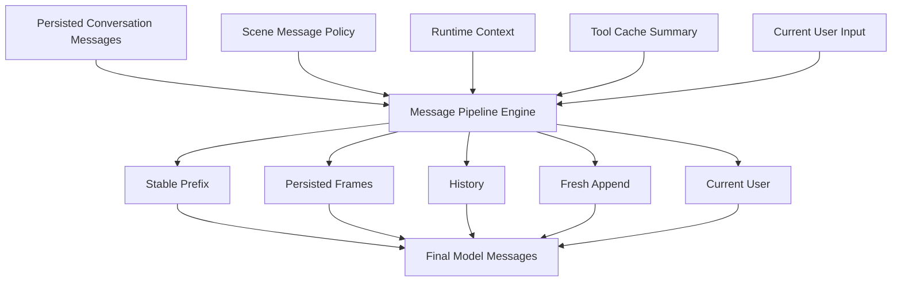
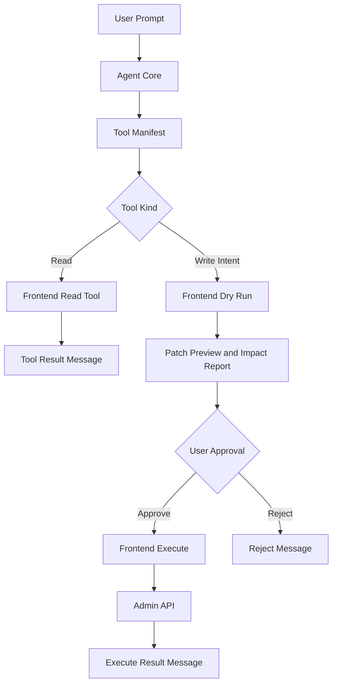

# Admin Agent Core Design

**Date:** 2026-05-31
**Author:** Innei
**Status:** Design

## 1. Motivation

The current admin AI agent implementation is centered on the write editor and
is coupled to `@haklex/rich-agent-core`. That coupling is acceptable for
editor-local assistance, but it is not an adequate foundation for a general
admin copilot. The next agent layer must support global content operations,
controlled write workflows, future in-page invocation, and eventual migration
of the write editor agent into a common admin-owned runtime.

The design therefore uses a contract-first foundation:

| Area | Decision |
| --- | --- |
| Long-term core | Build an admin-owned agent core independent of `@haklex/rich-agent-core`. |
| First host | Implement the first user-facing host as `/ai/agent`. |
| Future host | Design the surface so a FAB/floating panel can host the same core later. |
| Tool execution | Keep all tools frontend-defined and frontend-executed. |
| Write safety | Require frontend dry-run and explicit user approval before any write. |
| Backend role | Keep the backend as auth, model proxy, and generic conversation persistence. |

## 2. Current State

The current conversation persistence model is intentionally small.

| Source | Current fields |
| --- | --- |
| `packages/db-schema/src/schema/ai.ts` | `id`, `sessionId`, `model`, `providerId`, `title`, `messages`, `createdAt`, `updatedAt` |
| `apps/admin/src/api/ai-agent.ts` | `id`, `sessionId`, `model`, `providerId`, `title`, `messages?`, `createdAt`, `updatedAt` |
| `apps/core/src/modules/ai/ai-agent/ai-agent.schema.ts` create DTO | `sessionId`, `messages`, `model`, `providerId` |
| `apps/core/src/modules/ai/ai-agent/ai-agent.schema.ts` update DTO | `sessionId`, `model`, `providerId` |

The existing write agent already provides useful reusable pieces:

| Existing piece | Reuse decision |
| --- | --- |
| SSE chat proxy | Reuse as the stateless model streaming channel; it never persists conversation state. |
| Provider/model selection | Extract to a common admin agent contract. |
| Conversation CRUD and title generation | Reuse with frontend-defined `sessionId` grouping. |
| Haklex store and loop | Do not use as the common core. Keep behind a compatibility adapter. |
| Review batch data model | Treat as editor-specific until migrated into generic dry-run/apply results. |

## 3. Scope

### In Scope

- Define common agent contracts for transport, model selection, conversation
  access, message frames, tool events, and surface rendering.
- Build an admin-specific core that owns scene resolution, message pipeline
  compilation, frontend tool routing, dry-run gating, and execution approval.
- Implement the first host as a `/ai/agent` general workbench.
- Support the `general` scene for global agent usage.
- Define the `in-page` scene contract at resource-level context granularity,
  without implementing the floating panel host in this phase.
- Support the following acceptance scenarios:
  - query data and analyze it;
  - batch-edit article data through dry-run and confirmation;
  - batch-read comments and prepare confirmed replies.
- Keep the backend scene-agnostic and avoid adding `scene`, `host`,
  `originRoute`, or `originResource` columns.

### Out of Scope

- Full migration of the current write editor agent to the new admin core.
- Replacement of `@haklex/rich-agent-core` in the write page.
- FAB/floating panel UI implementation.
- Selection-level context injection from highlighted text or editor blocks.
- Backend-owned tool execution.
- Backend scene awareness.
- Snapshot tests that merely restate static prompt text or tool manifests.

## 4. Architecture

```mermaid
flowchart TD
  Contracts[Common Agent Contracts] --> AdminCore[Admin Agent Core]
  Contracts --> WriteAdapter[Haklex Write Adapter]

  AdminCore --> GeneralScene[General Scene]
  AdminCore --> InPageScene[In-page Scene Contract]

  GeneralScene --> Workbench[/ai/agent Workbench]
  InPageScene --> Floating[Future Floating Panel]

  AdminCore --> ToolRegistry[Frontend Tool Registry]
  ToolRegistry --> DryRun[Dry Run]
  DryRun --> Approval{User Approval}
  Approval -->|Approve| Execute[Frontend Execute]
  Approval -->|Reject| Discard[Discard]
```

| Module | Responsibility |
| --- | --- |
| Common Agent Contracts | Shared type and runtime contracts for chat transport, model selection, conversation access, message frames, tool events, and surface props. |
| Admin Agent Core | Scene resolution, context collection, message pipeline compilation, tool routing, dry-run/approval gate, and conversation updates. |
| Haklex Write Adapter | Compatibility layer that lets the write page reuse common transport/session/model contracts without migrating its loop in this phase. |
| Agent Surface | Host-agnostic UI for messages, tool results, confirmation panels, and composer. |
| Frontend Tool Registry | Declares tool manifests, read handlers, dry-run handlers, execute handlers, policy, and confirmation metadata. |
| Backend Chat Proxy | Streams model output through `/ai/agent/chat`; it does not execute admin tools. |

## 5. Scene, Host, and Context

The design distinguishes agent runtime scene from business acceptance scenario.

| Concept | Meaning | Examples |
| --- | --- | --- |
| Agent scene | Runtime context policy for prompt, context, and available tools. | `general`, `in-page` |
| Agent host | UI container that renders the agent surface. | `/ai/agent` page, future floating panel |
| Acceptance scenario | Business workflow used to validate the tool system. | data analysis, batch article edit, comment reply |

### Scene Definitions

| Scene | Host | Context | Tools |
| --- | --- | --- | --- |
| `general` | `/ai/agent` page | User goal, conversation history, tool-derived summaries, optional filters | Global content read tools, article patch dry-run tools, comment read/reply draft tools |
| `in-page` | Future floating panel | Current route, resource id, resource title, resource summary | Resource-scoped subset of the general tools |

`in-page` is designed at resource-level granularity. It does not include
selection-level text, selected table rows, or editor block context in this
phase.

### Runtime Context Ownership

| Context | Owner | Persisted as backend fields |
| --- | --- | --- |
| `scene` | Frontend scene resolver | No |
| `host` | Frontend host | No |
| `originRoute` | Frontend router context | No |
| `originResource` | Frontend resource context provider | No |
| available tools | Frontend tool resolver | No |
| dry-run policy | Frontend tool registry | No |

The backend remains unaware of scene semantics. If a context item must be
available in later model turns, the frontend may persist it as a structured
message frame inside `messages`, not as a dedicated backend column.

## 6. Message Pipeline Engine

The message pipeline is a first-class engine. It is responsible for building
the final model-visible `messages[]` from persisted conversation records,
scene policy, runtime context, tool-cache summaries, and the current user
input.



| Component | Responsibility |
| --- | --- |
| `MessagePipelineEngine` | Compile final `messages[]` in a deterministic, scene-aware, cache-friendly order. |
| `SceneMessagePolicy` | Define slots, frame types, retention rules, trimming strategy, and required reminders for each scene. |
| `FrameFactory` | Produce `core-system`, `scene-system`, `system-reminder`, `hint`, `document-structure`, `context-snapshot`, and `fresh-context` frames. |
| `MessageNormalizer` | Normalize persisted user, assistant, tool, dry-run, approval, and execute entries into model-readable messages. |
| `BudgetPlanner` | Decide which history and frames to preserve, summarize, trim, or append late under token budget. |
| `PersistencePlanner` | Decide which generated frames should be appended to conversation messages and which should stay runtime-only. |

### Persisted Schema vs Wire Schema (Compilation)

The conversation record and the model request use **two different message
schemas**. Conflating them is the single most load-bearing risk in this design.

| Schema | Owner | Shape | Where it lives |
| --- | --- | --- | --- |
| Persisted schema (rich) | Frontend engine | Frame-typed entries (`core-system`, `scene-system`, `dry-run-result`, `approval`, `execute-result`, `context-snapshot`, …) plus UIMessage-shaped bubbles | `ai_agent_conversations.messages` JSONB |
| Wire schema (role-bearing) | Frontend engine → backend | `{ role: 'system' \| 'user' \| 'assistant' \| 'assistant_tool_call' \| 'tool_result', … }` | Request body of `POST /ai/agent/chat` |

The backend translator `toPiMessages`
(`apps/core/src/modules/ai/ai-agent/ai-agent-chat.service.ts`) recognizes
**only** those five roles. It has no `default` branch: any entry whose `role` is
not one of the five is **silently dropped** and never reaches the model. The
backend never inspects a frame `type` field.

Therefore the engine MUST run a **compile step** that folds rich persisted
frames into wire role-messages before each request. The persisted array is the
source the engine recompiles from; the wire array is a derived, per-turn
projection.

| Persisted frame | Compiled wire role |
| --- | --- |
| `core-system`, `scene-system`, `system-reminder` | `system` |
| `hint`, `document-structure`, `context-snapshot`, `fresh-context` | `system` or `user` (engine choice) |
| user input | `user` |
| assistant text / thinking | `assistant` |
| assistant tool call | `assistant_tool_call` |
| `tool-result-summary` | `tool_result` |
| `dry-run-result`, `approval`, `execute-result` | `user` or `tool_result` (rendered as a text summary) |

Compilation invariants:

| Invariant | Decision |
| --- | --- |
| Persisted ≠ wire | The stored record holds rich frames; the request holds role-messages. They are never assumed equal. |
| Engine owns compilation | Folding frames into wire roles happens in the frontend engine, not the backend. |
| Backend is role-only | `toPiMessages` translates the five roles and drops everything else; do not rely on it to forward frame types. |
| No frame reaches the model unmapped | Every persisted frame the model must see has an explicit wire-role mapping; unmapped frames stay runtime-only. |

### Frame Persistence Rules

Some context must be persisted to preserve prompt-cache locality and support
future continuation. Persistence does not make the backend scene-aware; the
backend stores ordinary JSON messages.

| Frame | Persist | Strategy |
| --- | --- | --- |
| `core-system` | Yes, or versioned singleton | Stable prefix; avoid content churn. |
| `scene-system` | Yes | Append or update only when the scene policy version changes. |
| `system-reminder` | Yes | Keep long-lived write-safety rules stable. |
| `hint` | Optional | Append when a user or session preference matters. |
| `document-structure` | Optional or yes | Append a new version when the document/resource structure changes. |
| `context-snapshot` | Optional or yes | Persist summarized read results, not raw payloads. |
| `fresh-context` | Usually no | Inject after history and before the current user input. |
| `tool-result-summary` | Yes | Persist normalized summaries; keep raw payloads in frontend cache. |
| `dry-run-result` | Yes | Persist hash, impact, patch summary, and blocking reasons. |
| `approval` | Yes | Persist decision and dry-run hash. |
| `execute-result` | Yes | Persist success and failure summary. |

### Slot Policy

| Slot | Contents | Cache-oriented rule |
| --- | --- | --- |
| `stablePrefix` | Core system, scene system, long-lived reminders | Keep content and order stable. |
| `persistedFrames` | Hints, document structures, context snapshots | Append rather than rewrite. |
| `history` | User, assistant, and tool timeline | Trim by semantic relevance and recency. |
| `freshAppend` | Latest route, resource, query, or tool-cache summary | Insert late so the prefix remains cacheable. |
| `currentUser` | Current user request | Last message. |

Default scene policies:

| Scene | Default slot order |
| --- | --- |
| `general` | `stablePrefix -> persistedFrames -> history -> freshAppend -> currentUser` |
| `in-page` | `stablePrefix -> history -> freshAppend(route/resource latest) -> toolPolicy reminder -> currentUser` |

### Message Pipeline Constraints

| Constraint | Decision |
| --- | --- |
| Persisted messages are not raw model messages | The engine recompiles them into final model messages on every turn. |
| Cache hit is a design goal | Stable system and scene frames are deterministic and versioned. |
| New data is append-oriented | New context is inserted later instead of rewriting the stable prefix. |
| Raw data remains outside prompt | The frontend tool cache retains raw payloads; summaries enter messages. |
| Tool manifest is separate | Tool schemas are sent through the request `tools` parameter, while tool policy reminders may be message frames. |
| Backend remains scene-agnostic | The backend stores message JSON but does not parse frame semantics. |
| Backend translator is role-only | `toPiMessages` recognizes only the five wire roles; frames with any other discriminator are dropped before the model, so the engine must emit compiled wire messages, not raw frames. |

## 7. Tool Execution Model



| Stage | Executor | Rule |
| --- | --- | --- |
| Tool declaration | Frontend | Each scene exposes its own tool manifest. |
| Read tool | Frontend | Can execute directly, subject to pagination, field selection, and redaction. |
| Write intent | Model output | Produces structured intent only; it never calls admin write APIs directly. |
| Dry run | Frontend | Computes patch, impact, conflict state, and blocking reasons. |
| Review | User | UI shows diff, affected resources, risk, and intended API calls. |
| Execute | Frontend | Runs only after approval and against the approved dry-run result. |
| Persist | Frontend plus conversation API | Stores normalized tool events in the conversation timeline. |

### Tool Categories

| Type | Examples | Automatic execution |
| --- | --- | --- |
| `read` | Search posts, read comments, query categories, read aggregate stats | Allowed within policy. |
| `draftPatch` | Generate title, slug, summary, tags, or category patch | Not allowed; must dry-run. |
| `replyDraft` | Generate comment reply draft | Not allowed; must confirm before publish. |
| `executePatch` | Apply article batch edits | Frontend only after approved dry-run. |
| `executeReply` | Publish comment reply | Frontend only after approval. |

### Write Safety Invariants

| Invariant | Enforcement |
| --- | --- |
| Agent does not own write authority | Agent output can only request a tool intent. |
| No dry-run, no write | Execute handlers require a prior dry-run result. |
| Execute binds to dry-run | Execute references a dry-run id or hash. |
| User confirms the specific result | The approved hash must match the execution input. |
| Tool availability is scene-scoped | The scene resolver controls which tools are visible. |
| Tool events are auditable | Tool call, dry-run, approval, rejection, and execute result enter the timeline. |

## 8. Backend Boundary

The backend should remain a generic transport and persistence layer for this
phase.

| Backend can do | Backend must not do |
| --- | --- |
| Authenticate requests | Decide scene behavior |
| Resolve model provider configuration | Select frontend tools |
| Stream model output through `/ai/agent/chat` | Execute admin write actions on behalf of the model |
| Persist conversations through `/ai/agent/conversations` | Add scene-specific columns |
| Store opaque message JSON | Interpret dry-run, approval, or tool frame semantics |

### Conversation Persistence

| Persisted field | Meaning |
| --- | --- |
| `sessionId` | Frontend-defined grouping key, such as a general workbench thread or legacy write-agent document thread. |
| `messages` | Conversation transcript and frontend-defined structured frames. |
| `model` | Selected or last-used model id. |
| `providerId` | Selected or last-used provider id. |
| `title` | Conversation title. |
| `createdAt`, `updatedAt` | Lifecycle and sorting fields. |

No new backend fields are required for `scene`, `host`, `originRoute`, or
`originResource`.

### Persistence Write Authority

The frontend admin core is the **sole writer** of `messages[]`. The backend chat
proxy is stateless and never persists conversation state.

| Rule | Decision |
| --- | --- |
| Single writer | The frontend persists the conversation via `PUT /ai/agent/conversations/:id/messages` (whole-array replace). |
| Stateless chat proxy | `POST /ai/agent/chat` streams model output only; it never writes to the conversation and never receives a `conversationId`. |
| No server-side append | The model's assistant message is reassembled on the frontend for UIMessage rendering; writing it back is incidental, so no second writer is introduced. |

**Rationale.** Admin runs a single operator and a single session manager, so a
server-side append path would only add cross-writer sequencing complexity
(ordering the server's assistant append against the frontend's tool-result
append) for no real gain. A single frontend writer with whole-array replace
keeps the write path race-free.

**Dead-code removal.** The dormant server-write path must be deleted so it cannot
be re-wired by accident:

| Remove | Location |
| --- | --- |
| `StreamChatOptions.conversationId`, the `streamChat` finally-block persist, `persistAssistantMessage` | `apps/core/src/modules/ai/ai-agent/ai-agent-chat.service.ts` |
| PATCH append chain: controller `appendMessages`, service `appendMessages`, api-client `appendAgentConversationMessages` | controller / conversation service / `apps/admin/src/api/ai-agent.ts` |
| Keep `PUT .../messages` (replace) as the only write entry point | — |

## 9. Acceptance Scenarios

| Scenario | Goal | Required validation |
| --- | --- | --- |
| Query data and analyze | The general workbench can use read tools to fetch content-operation data and produce analysis. | Pagination, field trimming, summary injection, and no write execution. |
| Batch edit articles | The agent proposes article patches; the frontend dry-runs them; the user approves; the frontend executes. | Patch preview, impact report, dry-run hash binding, and confirmed write. |
| Batch read comments and reply | The agent reads comments and prepares reply drafts. | Drafts do not auto-publish; confirmed replies call the comment API; failures are visible. |

## 10. Testing Strategy

| Layer | Coverage |
| --- | --- |
| Unit | Message pipeline slot ordering, frame persistence planning, budget trimming, tool policy gates, dry-run hash binding, message reducer. |
| Integration | `/ai/agent` workbench with mock SSE and mock tools through multi-turn read, dry-run, approval, and execute flows. |
| API compatibility | Current `/ai/agent/chat` and conversation CRUD remain compatible with the existing write agent. |
| Regression | The current Haklex write agent can still send messages, persist conversations, and generate titles. |
| E2E-like | Batch article edit fails if dry-run, approval, or hash binding is skipped. |

Low-signal tests should be avoided:

| Avoid | Reason |
| --- | --- |
| Static tool manifest snapshots | They restate internal declarations rather than behavior. |
| Full prompt snapshots | Prompt wording should evolve; validate required constraints instead. |
| Backend scene-field tests | Scene is frontend runtime context, not backend schema. |
| Real-model output assertions | Model output is nondeterministic; use mock streams and structured tool calls. |

## 11. Unified Core Migration TODO and Roadmap

This section is intentionally limited to work not included in the current
specification. It records the path for replacing the existing Haklex agent loop
with the common admin agent core.

### TODO

| Item | Description |
| --- | --- |
| Replace Haklex loop | Move the write page from `@haklex/rich-agent-core` loop execution to the admin agent core. |
| Normalize editor tools | Expose Lexical/Haklex editor operations as standard frontend tools. |
| Migrate review batch | Map the current review batch model to generic dry-run patch and apply-result records. |
| Unify conversation state | Make the write page and `/ai/agent` use the same conversation schema and session manager. |
| Remove adapter | Delete the Haklex compatibility adapter after the write page runs on the admin core. |

### Roadmap

| Phase | Goal |
| --- | --- |
| R1 Adapter compatibility | The write page remains functional while sharing transport, model, and conversation contracts. |
| R2 Editor tool standardization | Editor operations are exposed as admin frontend tools. |
| R3 Write agent core migration | The write page agent is driven by the admin agent core. |
| R4 Haklex agent removal | Remove the Haklex agent loop/store dependency and retain only editor capabilities. |

## 12. Open Constraints

| Constraint | Decision |
| --- | --- |
| Backend scene awareness | Prohibited for this phase. |
| Tool ownership | Frontend only. |
| Write execution | Frontend only after dry-run and approval. |
| Stable prefix churn | Minimize through versioned, persisted frames. |
| Context freshness | Append fresh context late rather than mutating the prefix. |
| Future floating panel | Must be possible without changing backend conversation schema. |
| Conversation write authority | Frontend only; the backend chat proxy stays stateless and never appends. |
| Persisted vs wire schema | The engine compiles rich persisted frames into role-bearing wire messages each turn; the backend translates only the five wire roles. |
