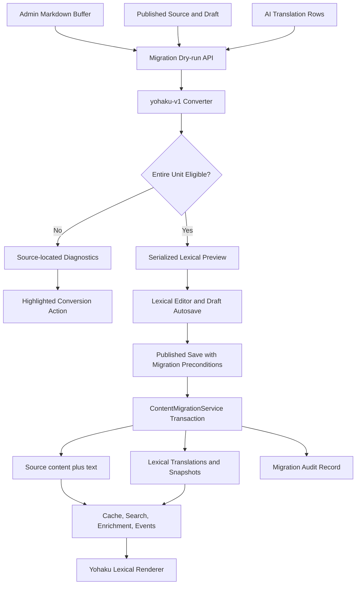

# Admin Progressive Markdown-to-Lexical Migration — Design

**Date:** 2026-07-28
**Status:** Draft (awaiting review)
**Scope:** `packages/editor`, `apps/admin`, `apps/core`, `packages/db-schema`, and Yohaku
**Related:** `docs/superpowers/specs/2026-06-08-lexical-text-ownership-design.md`, `docs/superpowers/specs/2026-05-24-lexical-block-partial-translation-design.md`

## 1. Summary

Admin currently supports both Markdown and Lexical documents, but an existing
non-empty Markdown document cannot switch to Lexical. The format control is
replaced by an unavailable-state help affordance as soon as the editor contains
content.

This design replaces that global prohibition with progressive, document-level
migration:

- every non-empty Markdown document exposes a highlighted, interactive
  **Convert to Lexical** action;
- eligibility is computed from the syntax actually present in that document,
  not from whether every historical Yohaku Markdown feature has a Lexical
  equivalent;
- a document is convertible only when every syntax region in its migration
  unit has a behavior-preserving mapping;
- unsupported documents remain Markdown and receive source-located
  diagnostics; their conversion action remains interactive;
- conversion in the editor changes the active editing buffer and draft, but
  does not publish content by itself;
- the published document and all existing AI translations transition to
  Lexical atomically when the converted document is saved;
- Markdown draft history remains an immutable audit record;
- `text` remains the writer-owned Markdown projection of Lexical `content`.

The initial release intentionally supports a useful subset of the current
Markdown grammar. Unsupported features do not block the release and do not
block documents that do not use them.

## 2. Decision

The migration gate is per migration unit, not global.

> A Markdown document may migrate when every syntax region used by the active
> source buffer and every coupled AI translation can be converted without
> silent semantic or behavioral degradation.

The following are explicit consequences:

| Question                                                                     | Decision                  |
| ---------------------------------------------------------------------------- | ------------------------- |
| Must every Yohaku Markdown feature be supported before release?              | No.                       |
| May a document containing only supported syntax migrate?                     | Yes.                      |
| Is the conversion action disabled for an unsupported document?               | No; it opens diagnostics. |
| May unsupported syntax be flattened to text?                                 | No.                       |
| May the source become Lexical while a valid AI translation remains Markdown? | No.                       |
| Does clicking the conversion action publish the document?                    | No.                       |
| May the active draft become Lexical before the published source does?        | Yes.                      |
| Are historical draft snapshots rewritten?                                    | No.                       |
| Is general Lexical-to-Markdown format switching added?                       | No.                       |

## 3. Current State

### 3.1 Admin

`WriteRouteViewsContent.tsx` owns a dual-format form state:

- `contentFormat: 'markdown' | 'lexical'`;
- `text` for Markdown content and the Lexical Markdown projection;
- `content` for serialized Lexical JSON.

The current switch rule is content-based:

```ts
const canSwitchEditorType =
  state.contentFormat === 'lexical'
    ? !hasLexicalContent(state.content)
    : !state.text.trim()
```

When `canSwitchEditorType` is false, `EditorMetaStrip` removes the format action
and renders a help popover explaining that switching is unavailable. Lexical
writes are projected through `mxLexicalToMarkdown()` before save.

Draft autosave runs independently from the published save path. A design that
stages a Lexical editor state must therefore define how draft persistence and
published migration interact.

### 3.2 Core persistence

Posts, notes, pages, drafts, and draft histories already persist:

| Field            | Markdown meaning       | Lexical meaning                  |
| ---------------- | ---------------------- | -------------------------------- |
| `content_format` | `markdown`             | `lexical`                        |
| `text`           | authoritative Markdown | writer-owned Markdown projection |
| `content`        | absent                 | serialized Lexical state         |

Lexical creates and updates require `content` and `text` to travel as an atomic
pair. This design preserves that ownership rule.

### 3.3 AI translations

`ai_translations` already stores:

- `content_format` and `content`;
- the Markdown `text` projection;
- `source_block_snapshots`;
- `source_meta_hashes`;
- the whole-source `hash` and `source_modified_at`.

The translation service selects the Markdown or Lexical strategy from the
source `contentFormat`. Fresh translations generated after a source is Lexical
already produce Lexical content. Historical translation rows require explicit
migration.

### 3.4 Yohaku

Yohaku selects Markdown or Lexical rendering independently for posts, notes,
and pages. Its Markdown runtime is based on `markdown-to-jsx` plus custom rules,
custom containers, raw component overrides, and special code-fence behavior.

Yohaku's existing Lexical renderer covers much, but not all, of that behavior.
Heading anchors, footnote interactions, table alignment, code-fence attributes,
and several container/component forms require parity work before documents
using those features become eligible.

### 3.5 Existing Markdown conversion

`@mx-space/editor` currently exposes `mxLexicalToMarkdown()`. Haklex also
provides Markdown paste transformers, but those transformers are designed for
editing convenience rather than lossless migration:

- several rich block transformers are export-only;
- tables lose alignment and inline cell structure;
- unsupported containers may become literal paragraphs;
- fenced-code attributes are not preserved;
- arbitrary HTML and custom React-like elements are not modeled.

The paste path is not a migration path.

## 4. Goals

- Allow supported Markdown documents to migrate before the entire grammar has
  Lexical coverage.
- Keep the conversion action visible, highlighted, and interactive for every
  non-empty Markdown document.
- Provide exact, source-located explanations for blocked documents.
- Preserve Yohaku's externally observable rendering and interaction behavior.
- Prevent silent fallback of unsupported syntax to plain text.
- Convert the active editing buffer without implicitly publishing it.
- Keep source, current draft, and AI translation format transitions
  consistent.
- Preserve stable root block identity across source and translations.
- Preserve the `content + text` writer-owned pair.
- Make dry-run and commit deterministic, versioned, and safe under concurrent
  edits.
- Reuse one conversion implementation for Admin preview, Core validation, and
  later bulk migration.

## 5. Non-goals

- Waiting for every historical Markdown feature to be supported.
- Byte-identical Markdown round trips.
- Deleting the `text` column or changing its projection role.
- Migrating comments, thinking entries, skills, project readmes, summaries, or
  other Markdown-bearing fields outside the post/note/page write model.
- Rewriting draft history.
- Adding a general Lexical-to-Markdown editor switch.
- Automatically executing arbitrary HTML, style, or script through a new
  Lexical node.
- Automatically spending AI quota to regenerate blocked translations in the
  first release.
- Removing Yohaku's Markdown renderer in the first release.
- Shipping a bulk migration interface before per-document migration is stable.

## 6. Terminology

| Term                          | Meaning                                                                                                                           |
| ----------------------------- | --------------------------------------------------------------------------------------------------------------------------------- |
| Conversion profile            | A versioned description of source grammar and target-node behavior; initially `yohaku-v1`.                                        |
| Syntax feature                | A recognized Markdown construct such as `inline.spoiler` or `container.gallery`.                                                  |
| Supported feature             | A feature with a behavior-preserving parser, target node, projection, and Yohaku renderer.                                        |
| Blocking issue                | A source range that cannot be converted without loss or unsafe fallback.                                                          |
| Active source buffer          | The Markdown currently visible in Admin, including unsaved or draft-backed edits.                                                 |
| Published source              | The persisted post, note, or page currently served publicly.                                                                      |
| Migration unit                | The active source buffer, selected/current draft, published source transition, and all AI translations for one content reference. |
| Staged conversion             | A successful conversion loaded into the Lexical editor before the published source has been saved as Lexical.                     |
| Pure representation migration | A save whose Lexical content is semantically identical to the converted Markdown baseline.                                        |
| Migration with edits          | A save where the user changed the staged Lexical document before publishing.                                                      |

## 7. Invariants

### 7.1 Document-level eligibility

Global converter completeness is never a prerequisite. Eligibility is computed
for one migration unit at a time.

### 7.2 Complete source coverage

Every source range must be classified as one of:

- supported syntax;
- plain text;
- whitespace/trivia;
- a blocking unsupported construct.

An unknown container, HTML element, or fence attribute must not disappear into
a generic paragraph and thereby produce a false `convertible` result.

### 7.3 No silent degradation

Unsupported syntax blocks conversion. It must not be:

- dropped;
- flattened to text;
- converted into a visually similar but behaviorally different node;
- stored in an untyped catch-all node without an explicit future product
  decision.

### 7.4 Atomic published transition

When a published source transitions from Markdown to Lexical, every valid
`ai_translations` row for that source must become Lexical in the same database
transaction. A mixed published state is invalid.

An active draft may be Lexical while the published source is still Markdown.
Drafts are private editing artifacts and do not determine the public rendering
or translation strategy.

### 7.5 Writer-owned projection

For every Lexical write:

```text
content = authoritative serialized Lexical state
text    = writer-owned Markdown projection of that exact state
```

Core validates and stores the pair. The migration service is an explicitly
named internal writer and may derive both fields during translation migration.

### 7.6 Stable block identity

Converted source root blocks receive stable IDs. Converted translation blocks
copy the ID of the source block to which they are structurally aligned.
Index-only alignment is insufficient once structures diverge.

### 7.7 Idempotence and concurrency

Re-running dry-run against unchanged inputs returns an equivalent result.
Commit must fail safely when any source, draft, or translation precondition has
changed since dry-run.

### 7.8 Historical preservation

Draft histories and migration audit records retain the pre-migration Markdown.
No automatic rollback overwrites a user's current content.

## 8. Scope and Migration Unit

### 8.1 Eligible source types

The first release supports persisted records whose `contentFormat` is
`markdown`:

- posts;
- notes;
- pages.

Any page represented outside this content-format contract is out of scope.

### 8.2 Coupled records

For a content reference `(refType, refId)`, the migration unit contains:

| Member                      | Eligibility role                                    | Commit behavior                             |
| --------------------------- | --------------------------------------------------- | ------------------------------------------- |
| Active Admin source buffer  | Must scan successfully                              | Becomes submitted Lexical source            |
| Published source            | Must still match the expected persisted version     | Transitions to Lexical on save              |
| Selected/current live draft | Must remain compatible with the active buffer       | May autosave as Lexical before publish      |
| AI translation rows         | Every Markdown row must scan and structurally align | Transition atomically with published source |
| Draft history               | None                                                | Remains unchanged                           |

No translation rows is a valid migration unit.

### 8.3 Translation strictness

The first release does not automatically regenerate a translation to make the
source eligible. If one translation cannot be converted or aligned, the unit
is blocked and diagnostics identify the language and source range.

A later release may add an explicit “discard and regenerate this translation”
decision. That is not implicit behavior.

## 9. Architecture



### 9.1 Ownership

| Component            | Responsibility                                                                                                                  |
| -------------------- | ------------------------------------------------------------------------------------------------------------------------------- |
| `packages/editor`    | Pure grammar scanning, conversion, diagnostics, projection, and structural alignment primitives                                 |
| `apps/admin`         | Current buffer ownership, conversion affordance, diagnostics UI, staged editor state, and migration metadata on save            |
| `apps/core`          | Authoritative dry-run, concurrency validation, transactional persistence, audit, translation migration, and post-commit effects |
| `packages/db-schema` | Optional migration audit persistence                                                                                            |
| Yohaku               | Runtime behavioral parity for converted nodes                                                                                   |

React components do not own grammar rules or database migration logic.

## 10. Conversion Profile

### 10.1 Public API

`@mx-space/editor` adds a DOM-free entrypoint:

```ts
export type MarkdownConversionProfile = 'yohaku-v1'

export interface MarkdownSourceRange {
  start: { line: number; column: number; offset: number }
  end: { line: number; column: number; offset: number }
}

export interface MarkdownConversionIssue {
  code: string
  feature: string
  message: string
  range: MarkdownSourceRange
  severity: 'blocking'
  details?: Record<string, unknown>
}

export interface MarkdownFeatureOccurrence {
  feature: string
  range: MarkdownSourceRange
  targetNode?: string
}

export type MarkdownConversionResult =
  | {
      status: 'convertible'
      converterVersion: string
      profile: MarkdownConversionProfile
      sourceHash: string
      features: MarkdownFeatureOccurrence[]
      content: SerializedMxEditorState
      text: string
    }
  | {
      status: 'blocked'
      converterVersion: string
      profile: MarkdownConversionProfile
      sourceHash: string
      features: MarkdownFeatureOccurrence[]
      issues: MarkdownConversionIssue[]
    }

export function analyzeMxMarkdown(
  markdown: string,
  options: {
    profile: MarkdownConversionProfile
    blockIdFactory?: (path: string) => string
  },
): MarkdownConversionResult
```

Conversion and analysis are one operation. A separate boolean
`canConvertMarkdown()` API is prohibited because it would encourage eligibility
logic to diverge from actual conversion.

### 10.2 Runtime constraints

The converter must be:

- deterministic;
- usable in browsers and Node.js;
- independent of React and the DOM;
- explicit about every unsupported construct;
- able to report source ranges;
- able to accept a stable root block ID factory;
- versioned independently from the profile name.

`profile` identifies source semantics. `converterVersion` identifies the exact
implementation used for a dry-run result. Adding support for a previously
blocked feature changes `converterVersion` but does not necessarily require a
new source profile.

### 10.3 Detection order

The parser must recognize high-specificity constructs before generic Markdown:

1. fenced blocks and their raw attributes;
2. `:::` containers;
3. raw HTML/component elements;
4. block KaTeX and GFM alerts;
5. tables, lists, quotes, headings, footnotes, and other standard blocks;
6. custom inline tokens;
7. standard inline Markdown;
8. plain text and trivia.

This order prevents custom source from being consumed as ordinary paragraphs.

### 10.4 Coverage accounting

The parser records source spans for recognized structural tokens and performs a
second unsupported-construct scan for patterns that generic Markdown might
otherwise accept as text:

- unknown `::: name` containers;
- unregistered HTML-like element names;
- raw `script` and `style`;
- custom code-fence attributes;
- unclosed custom blocks;
- malformed custom mentions and component tags that the current runtime would
  partially interpret.

The second scan is a safety layer, not an alternate parser. It may produce
false-negative eligibility, but must not produce false-positive eligibility.

## 11. Syntax and Behavior Matrix

The matrix is based on Yohaku's runtime parser and renderer rather than
documentation-only examples.

### 11.1 Standard Markdown

| Source feature                  | Target                                          | Initial status                                 | Required behavior                                      |
| ------------------------------- | ----------------------------------------------- | ---------------------------------------------- | ------------------------------------------------------ |
| Paragraph and line break        | Paragraph/Text nodes                            | Supported                                      | Preserve inline ordering and hard breaks               |
| ATX and Setext heading          | HeadingNode                                     | Supported after anchor parity                  | Preserve heading level and historical anchor           |
| Bold, italic, strikethrough     | Text formats                                    | Supported                                      | Preserve nested combinations                           |
| Inline code                     | Code text format                                | Supported                                      | Preserve literal content                               |
| Ordered/unordered list          | ListNode/ListItemNode                           | Supported                                      | Preserve start value and nesting                       |
| Task list                       | Checklist state                                 | Supported                                      | Preserve checked state                                 |
| Blockquote                      | QuoteNode                                       | Supported                                      | Preserve nested block structure                        |
| Horizontal rule                 | HorizontalRuleNode                              | Supported                                      | Equivalent rendering                                   |
| Inline link/autolink/mail link  | Link/AutoLink nodes                             | Supported                                      | Preserve target, title, and standalone-link enrichment |
| Reference link/image            | Resolved target nodes                           | Supported                                      | Reference syntax may normalize in projection           |
| Image                           | ImageNode or VideoNode by current runtime rules | Supported after fixture parity                 | Preserve URL, alt/caption, and media detection         |
| Table without alignment markers | Table nodes                                     | Supported after rich-cell importer             | Preserve inline cell content                           |
| Table with alignment markers    | Table nodes with alignment state                | Blocked until alignment support                | Preserve left/center/right behavior                    |
| HTML comment                    | CommentNode                                     | Supported when round-trip behavior is verified | Preserve comment payload                               |
| Arbitrary raw HTML              | None                                            | Blocked                                        | No silent execution or flattening                      |

### 11.2 Custom inline syntax

| Syntax                         | Current Yohaku behavior                        | Target                                           | Initial status                      |
| ------------------------------ | ---------------------------------------------- | ------------------------------------------------ | ----------------------------------- |
| `==text==`                     | Highlight/mark                                 | Highlight text format                            | Supported                           |
| `++text++`                     | Inserted text                                  | Insert format/node                               | Supported                           |
| `&#124;&#124;text&#124;&#124;` | Interactive spoiler                            | SpoilerNode                                      | Supported after interaction fixture |
| `[Display]{GH@name}`           | GitHub social mention                          | MentionNode with platform, account, display name | Supported                           |
| `{TW@name}`                    | Twitter/X social mention                       | MentionNode                                      | Supported                           |
| `{TG@name}`                    | Telegram social mention                        | MentionNode                                      | Supported                           |
| `$equation$`                   | Inline KaTeX                                   | KaTeXInlineNode                                  | Supported                           |
| `[^id]`                        | Footnote reference with tooltip and navigation | FootnoteNode                                     | Blocked until Yohaku parity         |

Malformed forms that Yohaku renders as literal text remain literal text. The
converter must not reinterpret a form more aggressively than Yohaku.

### 11.3 Custom block syntax

| Syntax                                                | Current behavior         | Target                        | Initial status                           |
| ----------------------------------------------------- | ------------------------ | ----------------------------- | ---------------------------------------- |
| `$$ equation $$`                                      | Block KaTeX              | KaTeXBlockNode                | Supported                                |
| `> [!NOTE]`, `TIP`, `IMPORTANT`, `WARNING`, `CAUTION` | GFM alert quote          | AlertQuoteNode                | Supported after nested-block parity      |
| `::: gallery`                                         | Image gallery            | GalleryNode                   | Supported after source extraction parity |
| `::: carousel`                                        | Carousel gallery         | GalleryNode with layout       | Supported after layout field             |
| `::: banner {type}`                                   | Rich banner              | BannerNode                    | Supported                                |
| `::: note/info/success/warn/warning/error/danger`     | Banner aliases           | Normalized BannerNode         | Supported                                |
| `::: grid {cols,gap,rows,type}`                       | Content/image grid       | GridContainerNode             | Blocked until node and renderer exist    |
| `::: masonry {gap}`                                   | Responsive image masonry | MasonryNode or Gallery layout | Blocked until node and renderer exist    |
| Unknown `:::` container                               | Undefined/custom         | None                          | Blocked with source range                |

Banner alias normalization must match Yohaku:

| Source alias                 | Target type |
| ---------------------------- | ----------- |
| `note`, `info`               | `note`      |
| `success`, `tip`             | `tip`       |
| `important`                  | `important` |
| `warn`, `warning`            | `warning`   |
| `error`, `danger`, `caution` | `caution`   |

### 11.4 Raw component syntax

| Source                    | Target                             | Initial status                             | Required behavior                                      |
| ------------------------- | ---------------------------------- | ------------------------------------------ | ------------------------------------------------------ |
| `<details><summary>...`   | DetailsNode                        | Supported after nested Markdown parity     | Preserve summary, open/print behavior, and children    |
| `<Tabs><tab label="...">` | TabsNode with nested editor states | Blocked                                    | Preserve ordered panels and labels                     |
| `<video ...>`             | VideoNode                          | Supported after attribute parity           | Preserve src, poster, size, and controls behavior      |
| `<LinkCard ...>`          | LinkCardNode                       | Supported only for recognized current form | Legacy or unknown props block                          |
| `<Gallery ...>`           | GalleryNode                        | Supported only for a validated prop shape  | Unknown props block                                    |
| `<tag>`                   | TagNode                            | Supported after projection fixture         | Preserve inline behavior                               |
| `<style>`                 | None                               | Blocked                                    | Requires a separate security decision                  |
| `<script>`                | None                               | Blocked                                    | Current execution behavior is not inherited implicitly |
| Unknown element           | None                               | Blocked                                    | Report element name and range                          |

### 11.5 Fenced code

| Fence                                                               | Target                         | Initial status                  | Required behavior                               |
| ------------------------------------------------------------------- | ------------------------------ | ------------------------------- | ----------------------------------------------- |
| Ordinary language                                                   | CodeBlockNode                  | Supported                       | Preserve language and exact code                |
| `mermaid`                                                           | MermaidNode                    | Supported after renderer parity | Preserve diagram source                         |
| `excalidraw`                                                        | ExcalidrawNode                 | Supported after JSON validation | Preserve snapshot                               |
| `component`                                                         | Dedicated component/DLS node   | Blocked                         | Preserve catalog policy, source, and attributes |
| Fence with `shadow`, `with-styles`, collapse, or unknown attributes | CodeBlockNode with typed attrs | Blocked until schema exists     | Do not drop attributes                          |

## 12. Behavioral Parity Requirements

Node construction alone is insufficient. A feature is marked supported only
when Yohaku's Lexical renderer satisfies its observable contract.

### 12.1 Heading anchors

Markdown currently generates heading IDs in the form `index__slug` while the
Lexical renderer generates `slug`. Existing inbound links must remain valid.

Migrated HeadingNodes therefore carry `legacyAnchorId`, or the renderer emits a
legacy alias anchor. New Lexical-only documents may use the canonical slug
strategy with duplicate disambiguation.

### 12.2 Standalone links

A paragraph containing only a bare URL currently receives enriched block-link
rendering. Converted content must continue to enter that path.

### 12.3 Footnotes

Parity includes:

- tooltip content;
- click-to-scroll;
- target highlight;
- stable reference and definition IDs;
- the existing self-link LinkCard behavior.

Footnotes remain blocked until these behaviors are present in the Lexical path.

### 12.4 Tables

Parity includes:

- header state;
- column alignment;
- inline formatting inside cells;
- links and code inside cells;
- row and cell ordering.

### 12.5 Code blocks

Parity includes:

- language;
- exact code;
- raw attributes;
- Mermaid and Excalidraw special rendering;
- component/DLS security policy.

### 12.6 Raw scripts

The current Markdown article renderer may execute `script` when
`allowsScript` is enabled. This is not automatically carried into Lexical.
Documents containing script remain blocked until a separate security design
chooses one of:

- permanent rejection;
- a narrowly allowlisted script node;
- an isolated legacy rendering boundary.

## 13. Dry-run Contract

### 13.1 Endpoint

Core adds an admin-only endpoint conceptually shaped as:

```text
POST /admin/content-migrations/markdown-to-lexical/dry-run
```

Request:

```ts
interface MarkdownMigrationDryRunRequest {
  refType: 'post' | 'note' | 'page'
  refId: string
  draftId?: string
  sourceText: string
  profile: 'yohaku-v1'
}
```

`sourceText` is required because the active Admin buffer may contain edits not
yet present in the published row or autosaved draft.

Core reads the published source, relevant draft metadata, and all translation
rows. The client does not submit translation content.

### 13.2 Response

```ts
interface MigrationMemberPrecondition {
  kind: 'source' | 'draft' | 'translation'
  id: string
  hash: string
  version?: number
}

interface MarkdownMigrationDryRunResponse {
  status: 'convertible' | 'blocked'
  profile: 'yohaku-v1'
  converterVersion: string
  sourceHash: string
  preconditions: MigrationMemberPrecondition[]
  source: MarkdownConversionResult
  translations: Array<{
    id: string
    lang: string
    result: MarkdownConversionResult
    alignment?: {
      sourceBlockCount: number
      translationBlockCount: number
      alignedBlockCount: number
    }
  }>
  issues: Array<
    MarkdownConversionIssue & {
      member: 'source' | 'draft' | 'translation'
      memberId: string
      lang?: string
    }
  >
}
```

A blocked dry-run returns HTTP 200. Unsupported content is an expected product
state, not a transport error.

### 13.3 Side-effect boundary

Dry-run:

- performs no database write;
- creates no AI task;
- changes no source or translation freshness state;
- does not update `modifiedAt`;
- does not emit content events;
- does not log raw document text.

## 14. Translation Alignment

### 14.1 Baseline source

The dry-run converts `sourceText` into baseline Lexical content and assigns
stable root block IDs using a migration-specific ID factory keyed by:

- ref type;
- ref ID;
- source hash;
- root structural path.

The exact ID representation may use UUIDv5 or another collision-resistant
deterministic scheme. The externally important property is that Admin and Core
produce the same IDs for the same dry-run inputs.

### 14.2 Translation conversion

Each Markdown translation is converted independently. Its root blocks are then
aligned with baseline source blocks.

Alignment may use:

- structural node type;
- root path/order as an initial candidate;
- translatable segment/property shape;
- stable non-translatable properties;
- an LCS-style sequence match when insertions or deletions exist.

Index equality alone is not sufficient.

### 14.3 Alignment outcome

| Outcome                                        | Eligibility                                                                           |
| ---------------------------------------------- | ------------------------------------------------------------------------------------- |
| Every translated root block maps unambiguously | Eligible                                                                              |
| Source block has no translated counterpart     | Eligible only if existing partial-translation semantics can represent source fallback |
| Translated block has no source counterpart     | Blocked in the first release                                                          |
| Multiple source blocks are equally plausible   | Blocked                                                                               |
| Segment/property shape is incompatible         | Blocked                                                                               |

Aligned translated blocks copy the corresponding source `blockId`.

### 14.4 Freshness after save

If the submitted Lexical source is identical to the dry-run baseline:

- migrated translations receive the current source hash;
- source block snapshots are built from the migrated source;
- source meta hashes are recomputed;
- translations remain fresh.

If the user edits the staged Lexical source before save:

- translations are still persisted as Lexical;
- their snapshots describe the dry-run baseline;
- changed source blocks are treated as stale by the existing partial
  translation path;
- regeneration is scheduled through the existing stale-translation mechanism;
- no migrated row reverts to Markdown.

## 15. Admin Interaction Design

### 15.1 Format action states

`EditorMetaStrip` replaces `canSwitchFormat` with an explicit action model:

```ts
type FormatActionState =
  | { type: 'empty-switch' }
  | { type: 'migration-available' }
  | { type: 'migration-checking' }
  | { type: 'migration-blocked'; issueCount: number }
  | { type: 'migration-staged' }
  | { type: 'migration-committing' }
  | { type: 'lexical' }
```

| State                         | Visual behavior                                | Interaction                                             |
| ----------------------------- | ---------------------------------------------- | ------------------------------------------------------- |
| Empty Markdown                | Neutral format switch                          | Switch immediately                                      |
| Non-empty Markdown, unchecked | Highlighted “Convert to Lexical”               | Run dry-run                                             |
| Checking                      | Highlighted loading state                      | Prevent duplicate requests only                         |
| Convertible                   | Transition into Lexical editor                 | Preserve original Markdown migration metadata           |
| Blocked                       | Warning highlight with issue count             | Open or reopen diagnostics                              |
| Staged                        | Lexical active plus “Not yet published” status | Edit, autosave draft, or restore this staged conversion |
| Committing                    | Progress state                                 | Prevent duplicate save                                  |
| Published Lexical             | Normal Lexical format indicator                | No Markdown format switch                               |

The highlighted migration affordance must not reuse the visual selected state
of an already-Lexical document. It represents an action, not current format.

### 15.2 Click behavior

For non-empty Markdown:

1. send the active `sourceText` to dry-run;
2. if blocked, retain the Markdown editor and open diagnostics;
3. if convertible, load the returned source `content` into the Lexical editor;
4. retain the original Markdown, converter version, source hash, and
   preconditions in ephemeral migration state;
5. mark the draft dirty and allow the existing draft autosave to persist
   `content + text + contentFormat: lexical`;
6. do not update the published source until the normal save action.

### 15.3 Draft behavior

A Lexical draft backed by a Markdown published source is valid. It represents a
staged format transition.

Draft autosave stores the active Lexical pair but does not migrate AI
translations. AI translations are coupled to the published source, not the
private draft.

If the page reloads and Admin restores a Lexical draft over a Markdown source,
the write view reconstructs a staged migration state and reruns dry-run before
the next published save.

### 15.4 Restore before publish

While the published source remains Markdown, Admin may expose
“Restore original Markdown” for this staged conversion. This action restores
the captured source buffer; it is not a general Lexical-to-Markdown converter.

After the published source is Lexical, the restore action disappears. Any
rollback then uses an explicit migration-audit workflow and requires separate
user confirmation.

### 15.5 Diagnostics

Diagnostics are grouped by migration member:

```text
Source
  line 18–31   ::: masonry        unsupported layout node

AI translation: ja
  line 47      <script>           unsafe raw script
```

The panel supports:

- click-to-source for active-buffer issues;
- language and translation-row identification;
- issue code and required capability;
- recheck after converter upgrades;
- no disabled dead end.

## 16. Published Save and Commit

### 16.1 Save payload

The existing post/note/page write payload carries an optional migration
descriptor when the persisted source is Markdown and the submitted source is
Lexical:

```ts
interface MarkdownToLexicalMigrationDescriptor {
  profile: 'yohaku-v1'
  converterVersion: string
  sourceMarkdown: string
  sourceHash: string
  preconditions: MigrationMemberPrecondition[]
}
```

`sourceMarkdown` is the exact buffer converted during dry-run. It is not the
post-conversion `text` projection.

The normal lexical fields remain:

```ts
{
  contentFormat: 'lexical',
  content: serializedLexical,
  text: markdownProjection,
  migration: MarkdownToLexicalMigrationDescriptor
}
```

### 16.2 Transition detection

Core enters the migration path only when:

```text
persisted source format = markdown
submitted source format = lexical
migration descriptor is present
```

A direct Markdown-to-Lexical write without the descriptor fails validation.
This prevents third-party callers from producing a mixed source/translation
state.

Lexical-to-Lexical writes remain on the normal path.

### 16.3 Transaction

`ContentMigrationService.commitMarkdownToLexical()` performs:

1. authorize the same write permission as the source update;
2. reload source, linked current draft, and all translations with transaction
   locks;
3. verify every dry-run precondition;
4. rerun source and translation conversion with the named converter version;
5. validate the submitted Lexical state and `text` projection pair;
6. normalize and validate source root block IDs;
7. align and persist every translation as Lexical;
8. rebuild source block snapshots, source meta hashes, and translation hashes;
9. update the source and current draft;
10. insert one migration audit record;
11. commit;
12. trigger cache, search, file-reference, enrichment, and event work after
    commit.

Any failure rolls back the entire published transition.

### 16.4 Pure migration versus edited migration

Core compares the submitted Lexical state with the dry-run baseline using a
semantic fingerprint that ignores editor-only transient fields.

| Case                          | Timestamp/event behavior                                             |
| ----------------------------- | -------------------------------------------------------------------- |
| Pure representation migration | Preserve business `modifiedAt`; emit migration-specific invalidation |
| Migration plus semantic edits | Apply normal write timestamp and content-update behavior             |

Both cases invalidate render and search caches.

### 16.5 Idempotence

If a retry reaches a source already migrated by the same successful operation,
Core returns the current source when audit/precondition hashes prove
equivalence.

A source already Lexical for an unrelated reason returns a conflict rather
than applying stale migration data.

## 17. Persistence and Audit

The preferred design adds a compact audit table:

```ts
export const contentMigrationRecords = pgTable('content_migration_records', {
  id: pkText(),
  createdAt: createdAt(),
  refType: text('ref_type').notNull(),
  refId: refText('ref_id').notNull(),
  fromFormat: text('from_format').notNull(),
  toFormat: text('to_format').notNull(),
  profile: text('profile').notNull(),
  converterVersion: text('converter_version').notNull(),
  sourceHash: text('source_hash').notNull(),
  originalPayload: jsonb('original_payload').notNull(),
  resultHashes: jsonb('result_hashes').notNull(),
})
```

`originalPayload` contains only the source/draft/translation fields needed for
manual recovery. It is admin-only and never returned from public APIs.

The table supports:

- recovery investigation;
- idempotent retry evidence;
- converter-version audits;
- migration coverage reporting.

It does not create an automatic rollback endpoint in the first release.

## 18. Error Model

| Code                                     | HTTP                      | Trigger                                                             |
| ---------------------------------------- | ------------------------- | ------------------------------------------------------------------- |
| `MARKDOWN_MIGRATION_BLOCKED`             | 422 on commit             | A source or translation contains unsupported syntax                 |
| `MARKDOWN_MIGRATION_STALE`               | 409                       | A source, draft, or translation precondition changed                |
| `MARKDOWN_MIGRATION_ALIGNMENT_FAILED`    | 422                       | Translation blocks cannot be aligned safely                         |
| `MARKDOWN_MIGRATION_CONTENT_MISMATCH`    | 400                       | Submitted Lexical content/projection is invalid                     |
| `MARKDOWN_MIGRATION_DESCRIPTOR_REQUIRED` | 400                       | Markdown persisted source attempts a direct Lexical save            |
| `MARKDOWN_MIGRATION_ALREADY_APPLIED`     | 409 or idempotent success | Source is already Lexical; outcome depends on matching audit hashes |

Dry-run reports expected blocked states in its response rather than throwing
`MARKDOWN_MIGRATION_BLOCKED`.

Admin behavior:

| Failure             | UI behavior                                        |
| ------------------- | -------------------------------------------------- |
| Blocked dry-run     | Keep Markdown; show diagnostics                    |
| Stale commit        | Keep local Lexical buffer; rerun dry-run           |
| Network failure     | Keep current buffer and migration metadata         |
| Transaction failure | Keep source/translation database state unchanged   |
| Projection mismatch | Keep local content; report save validation failure |

## 19. Security

- Dry-run and commit require normal Admin write authorization.
- Translation content is loaded by Core; the client cannot substitute another
  translation row.
- Raw Markdown and translated text are never written to logs or telemetry.
- `script`, `style`, unknown HTML, and unknown component forms block migration.
- Diagnostic snippets are bounded and escaped before rendering.
- Migration audit payload is admin-only and excluded from general collection
  endpoints.
- Converter parsing must avoid catastrophic regular-expression backtracking;
  custom rules use bounded or non-backtracking forms.
- Commit reruns conversion and never trusts a client-only `convertible` flag.

## 20. Observability

Metrics:

| Metric                                 | Dimensions                    |
| -------------------------------------- | ----------------------------- |
| `markdown_migration_dry_run_total`     | ref type, result              |
| `markdown_migration_issue_total`       | feature, issue code           |
| `markdown_migration_commit_total`      | ref type, result, pure/edited |
| `markdown_migration_translation_total` | language, result              |
| `markdown_migration_duration_ms`       | dry-run/commit                |
| `markdown_migration_stale_total`       | member kind                   |

Structured logs contain IDs, hashes, converter version, counts, and issue codes
only. They do not contain source text.

The Admin Markdown management page may later aggregate:

- remaining Markdown source count;
- convertible count by current converter version;
- blocked count by feature;
- migrated count;
- translation blocker count.

## 21. Testing Strategy

Tests validate observable conversion and runtime behavior. They do not snapshot
static feature tables or transformer arrays.

### 21.1 Converter tests

| Case                                                | Expected behavior                                        |
| --------------------------------------------------- | -------------------------------------------------------- |
| Plain standard Markdown                             | Convertible Lexical content preserves semantic structure |
| Nested inline custom tokens                         | Formats/nodes preserve visible nesting                   |
| Known gallery/banner containers                     | Correct target node and properties                       |
| Unknown container                                   | Blocked with exact source range                          |
| Table with alignment before alignment support       | Blocked rather than alignment loss                       |
| Fence with unknown attrs                            | Blocked rather than attr loss                            |
| Raw script/style                                    | Blocked                                                  |
| Malformed custom token rendered literally by Yohaku | Preserved as literal text                                |
| Repeated identical conversion                       | Equivalent content and stable block IDs                  |
| Lexical-to-Markdown projection                      | Projection represents converted content without throwing |

### 21.2 Translation tests

| Case                                                        | Expected behavior                                                           |
| ----------------------------------------------------------- | --------------------------------------------------------------------------- |
| Source and translation have matching structures             | Translation receives source block IDs                                       |
| Translation inserts an unmatched block                      | Blocked in the first release                                                |
| Translation omits a source block with safe partial fallback | Eligibility follows the explicit alignment rule                             |
| One translation contains unsupported syntax                 | Whole migration unit is blocked                                             |
| No translation rows                                         | Source remains eligible                                                     |
| Submitted source is edited after staging                    | Translation becomes Lexical but stale/partial and regeneration is scheduled |
| Translation changes between dry-run and commit              | Commit returns stale conflict and writes nothing                            |

### 21.3 Core transaction tests

| Case                                        | Expected behavior                            |
| ------------------------------------------- | -------------------------------------------- |
| Source plus three translations succeeds     | All rows become Lexical in one transaction   |
| Second translation update fails             | Source and every translation remain Markdown |
| Preconditions changed                       | No writes; 409 stale                         |
| Pure representation migration               | Business modified timestamp preserved        |
| Migration plus edits                        | Normal modified timestamp behavior           |
| Retry after committed response loss         | Idempotent success when audit hashes match   |
| Direct format transition without descriptor | Validation failure                           |

### 21.4 Admin tests

| Case                                             | Expected behavior                                             |
| ------------------------------------------------ | ------------------------------------------------------------- |
| Non-empty Markdown document                      | Highlighted conversion action is visible and enabled          |
| Blocked document                                 | Action remains clickable and opens diagnostics                |
| Convertible document                             | Editor changes to Lexical without publishing                  |
| Draft autosave after staging                     | Draft stores Lexical `content + text`                         |
| Reload staged Lexical draft over Markdown source | Migration state is reconstructed and rechecked before publish |
| Restore before publish                           | Original Markdown buffer returns without reverse conversion   |
| Stale save response                              | Local Lexical buffer is preserved                             |
| Published Lexical source                         | No Markdown format switch is offered                          |

### 21.5 Yohaku parity tests

Use the current Yohaku syntax fixtures plus focused interaction tests:

- historical heading hashes still navigate;
- standalone links preserve enrichment;
- footnote tooltip, scrolling, and self-LinkCard work;
- gallery and banner layouts match;
- image/video decisions match;
- Mermaid and Excalidraw render;
- table alignment and rich cells match when enabled;
- unsupported script documents never reach the Lexical renderer.

Visual regression tests are appropriate for layout-heavy features. They are
behavioral outputs, not implementation snapshots.

## 22. Deployment

| Phase | Deliverable                                                           | Gate                                    |
| ----- | --------------------------------------------------------------------- | --------------------------------------- |
| 1     | `yohaku-v1` converter, diagnostics, stable IDs, and behavior fixtures | Package tests                           |
| 2     | Yohaku parity for the initial supported feature set                   | Yohaku behavior tests                   |
| 3     | Core dry-run, migration-aware save, transaction, and audit            | Core integration tests                  |
| 4     | Admin highlighted action, diagnostics, staged draft flow              | Admin tests                             |
| 5     | Feature flag enabled for internal documents                           | Error and blocker telemetry             |
| 6     | Add support for high-frequency blockers                               | Per-feature behavior tests              |
| 7     | Default new Admin documents to Lexical                                | Stable conversion/save metrics          |
| 8     | Add batch migration view using the same APIs                          | Per-document path proven                |
| 9     | Remove Markdown article write path                                    | Remaining eligible source count is zero |

Core support must deploy before the Admin action is enabled. Yohaku must render
every feature declared supported by that converter version before Admin can
produce it.

The Markdown renderer remains available throughout the progressive rollout.

## 23. Rollback and Recovery

Operational rollback:

1. disable the Admin migration feature flag;
2. stop new conversions;
3. leave successfully migrated Lexical documents on the normal Lexical path;
4. inspect failed or disputed migrations through audit records;
5. require explicit user confirmation before any record-level restoration.

There is no bulk automatic rollback. A conversion bug is corrected by:

- fixing the converter/renderer;
- identifying affected audit records by converter version;
- previewing a repair;
- explicitly applying the repair.

## 24. Future Extensions

- Explicitly discard and regenerate an unsupported AI translation.
- Add Tabs, Grid, Masonry, component/DLS, and safe typed HTML nodes.
- Add batch migration to the Admin Markdown management page.
- Convert Markdown imports directly into Lexical.
- Expose conversion dry-run through Admin Agent as a frontend-controlled tool.
- Remove the Markdown article renderer after all stored sources and active
  translations have migrated.

If exposed through Admin Agent, dry-run remains read-only and the user must
explicitly approve the write action. Agent integration reuses the same Core
contracts and does not own an alternate migration implementation.

## 25. Acceptance Criteria

- Every non-empty Markdown post, note, or page displays a highlighted,
  interactive conversion action.
- A document using only supported syntax can enter the Lexical editor without
  waiting for unrelated syntax support.
- A blocked document remains Markdown and receives exact, actionable
  diagnostics.
- Unsupported syntax is never silently dropped, flattened, or executed.
- Conversion does not publish content by itself.
- A staged Lexical draft can coexist safely with a Markdown published source.
- Published Markdown-to-Lexical transition atomically migrates all existing AI
  translations.
- Any transaction failure leaves the published source and translations in
  their prior formats.
- Migrated translation blocks share stable IDs with aligned source blocks.
- `content` and `text` remain a consistent writer-owned pair.
- Pure representation migration does not create a false business-content
  modification.
- Yohaku renders every declared-supported feature with equivalent observable
  behavior.
- Draft histories remain unchanged.
- The implementation can add support for a new feature without changing the
  eligibility semantics or Admin interaction model.

## 26. Implementation Notes Deferred to Planning

- Exact internal file layout of the converter and diagnostics modules.
- Exact UUID namespace or stable-ID encoding.
- Exact Admin diagnostics panel placement and visual tokens.
- Exact audit JSON shape and retention policy.
- Whether converter-version pinning uses an exported constant or build
  metadata.
- Whether dry-run conversion results are recomputed on every request or cached
  briefly by source and translation hashes.

These choices may be finalized in the implementation plan without changing the
decisions or invariants in this design.
