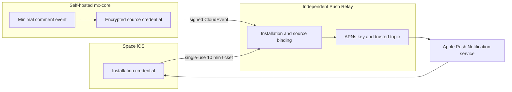

# Space —— mx-core iOS 管理端设计

日期：2026-08-05
状态：已批准，基础 UI 与操作路径已实现

## 1. 目标与非目标

### 目标

为自部署的 mx-core 提供一个原生 iOS 管理端，覆盖移动场景下的高频操作，并具备上架 App Store 的合规条件。

v1 功能范围：

- Today（站点状态、待办、今日数据与最近动态）
- Movement（从 Today 进入的流量详情）
- 评论审核
- Recently 查看、发布与编辑

### 非目标

- 不做 Lexical 富文本编辑器移动化。写作重活留在桌面端 admin。
- v1 不做文件上传与文件库；文件管理继续留在 Web Admin。
- 不纳入付费文章与会员域。App 内出现任何购买入口即触发 App Review 3.1.1 争议。
- 初始 UI v1 不依赖 APNs；评论推送已作为可选扩展实现，并由独立 Push Relay 承担 APNs 凭证与投递边界。
- 不做多服务器 / 多账号切换。

### 背景约束

`apps/admin` 现有三十余个功能域，全量对齐必致难产。本 spec 只覆盖上述四域，其余按需另开。

## 2. 已定决策

| 项       | 决策                                          | 理由                                                           |
| -------- | --------------------------------------------- | -------------------------------------------------------------- |
| 最低系统 | iOS 26                                        | 免写兼容分支；Liquid Glass 与 `tabBarMinimizeBehavior` 皆需 26 |
| 应用名   | Space                                         | ——                                                             |
| 工程位置 | 本 monorepo `apps/ios/`                       | 契约导出与 Swift 生成同提交内完成，漂移即时可见                |
| UI 骨架  | UIKit 底座 + SwiftUI 叶子页                   | 大列表与键盘协同场景 UIKit 掌控力强                            |
| 模块化   | SPM 本地包分层                                | 包边界即测试边界，三域可并行                                   |
| 认证     | better-auth device authorization 配对码       | 服务端插件与批准页已就绪；绕开 OAuth 回跳与 AASA 通配域名限制  |
| 数据层   | SwiftData 本地镜像                            | 离线可读、上屏即时、写操作可排队重试                           |
| API 契约 | Zod views → OpenAPI → swift-openapi-generator | 契约长期自动对齐，字段漂移编译期可见                           |
| 审核演示 | 公开 demo 实例 + 审核账号                     | App Review 2.1 要求 demo 账号命中真实后端                      |

### 已排除方案及理由

- **Passkey 登录**：Associated Domains 不支持通配域名，自部署下各用户域名各异，`apple-app-site-association` 无从托管。
- **OAuth 社交登录回跳**：同上，且一旦提供第三方登录即触发 Guideline 4.8 的 Sign in with Apple 强制要求。
- **API Key 直连**：长期明文凭证，无会话过期，不能远程吊销。
- **SwiftUI 为壳**：与 UIKit 底座取向相悖。且 iOS 26 下 `UITabBarController` 自动获得 Liquid Glass，UIKit 壳并不吃亏。
- **在 mx-core 中填写 APNs 凭证**：bundle id 必须匹配具体 App 构建，将凭证放入各自内容服务器会扩大密钥面；当前方案改为独立 Push Relay。

## 3. 架构

```
apps/ios/
├─ Space.xcodeproj
├─ Space/                    app target
│                            AppDelegate、SceneDelegate、RootTabBarController
│                            DI 装配、Router 实现、Assets、PrivacyInfo.xcprivacy
└─ Packages/
   ├─ SpaceCore/             生成的 OpenAPI client
   │                         APIClient 中间件（注入认证头 / 拆信封 / 映射错误）
   │                         KeychainStore、SwiftData 模型 + ModelActor
   │                         RealtimeClient
   ├─ SpaceUI/               设计 token + Liquid Glass 组件
   ├─ SpaceDashboard/
   ├─ SpaceComments/
   └─ SpaceCompose/          Recently 发布与编辑
```

### 依赖规则

- Feature 包依赖 `SpaceCore` 与 `SpaceUI`。
- `SpaceCore` 与 `SpaceUI` 互不依赖。前者不含 UI，后者不含网络。
- Feature 包之间禁止互相 import。跨域跳转由各 Feature 自行声明 `Router` 协议，app target 实现并注入。
- app target 只作装配，不含业务逻辑。

## 4. 认证与配对

服务端全链路已备（`apps/core/src/modules/auth/auth.implement.ts:197` 挂载 `deviceAuthorization` 插件，`device.controller.ts` 提供 approve/deny 页面），iOS 接入无需服务端改动。

流程：

1. 首启输入服务器地址，`GET {base}/api/v3/health` 探活（`API_VERSION = 3`）
2. `POST /api/v3/auth/device/code`，得 `user_code` 与 `verification_uri`
3. 屏显六位码与 QR。QR 指向 `/api/v3/device?user_code=…`，该页由服务端 EJS 渲染，已含批准与拒绝
4. 轮询 `/api/v3/auth/device/token` 直至授权完成，得 session token
5. token 存 Keychain，`kSecAttrAccessibleAfterFirstUnlock`（后台刷新需在解锁后可读）
6. 遇 401 清除凭证，回配对页

better-auth 的 basePath 在生产为 `/api/v{API_VERSION}/auth`，开发态无前缀。App 只支持生产形态。

## 5. 契约与数据流

### 契约生成链

新增于 `apps/core`：

- `scripts/export-openapi.ts` —— 读取 `*.views.ts` 中的 Zod schema，经 `z.toJSONSchema()`（zod 4.4.3 原生能力，无需第三方）转 JSON Schema，组装为 OpenAPI 3.1 文档
- 路由与 HTTP 方法取自显式清单 `src/common/openapi/route-manifest.ts`，只登记 v1 所需端点。**不做控制器反射** —— 反射实现脆弱，且 v1 用不到全量端点
- 产出 `apps/core/openapi.json`
- CI 增 `openapi:check`，比对产物与源，源改而未重新导出则失败
- `SpaceCore` 挂 swift-openapi-generator build plugin，构建期由该文件生成 client

### 信封与命名

Wire 层本就是 snake_case（`ResponseInterceptor` 在边界转换），生成的 Swift 属性直接映射，不作二次改名。

`{ data, meta }` 在 OpenAPI 中建为泛型响应包。`APIClient` 中间件统一拆包；`{ error: { code, message, details } }` 映射为 `SpaceError`。

### SwiftData 镜像

模型：`CachedComment`、`CachedDashboardSnapshot`、`DraftNote`、`PendingMutation`。

- **写路径**：乐观落地本地 → 入 `PendingMutation` 队列 → `ModelActor` 串行发送 → 成功则删记录，失败则递增 `retryCount` 并回滚 UI
- **读路径**：本地数据先上屏，网络响应到达后按 server id upsert
- **迁移**：v1 起即建 versioned schema 并配 `SchemaMigrationPlan`，避免日后无版本可迁

### 实时

`RealtimeClient` 接服务端既有 WebSocket gateway。评论事件到达即 upsert 本地库。断线走指数退避重连；前台恢复时先补一次增量拉取，不依赖重连补历史。

## 6. 页面与视觉

### 导航

底座 `UITabBarController`，三 tab：Today、Inbox、Content。Content 在 v1 只承载 Recently；Movement 从 Today 的数据卡片进入，不占 tab。Recently 新建使用 `UITabBarController.bottomAccessory` 提供的全局动作，不占 tab —— 它是动作而非目的地。

iOS 26 下 tab bar 自动获得 Liquid Glass，配 `tabBarMinimizeBehavior = .onScrollDown`。

### 技术分界

| 页面                    | 技术    | 理由                                                                         |
| ----------------------- | ------- | ---------------------------------------------------------------------------- |
| Today                   | SwiftUI | 只读卡片布局，按待办、今日数据、定时内容与最近动态分流                       |
| Movement                | SwiftUI | 固定时间范围选择器、Swift Charts 与阅读排行                                  |
| Inbox 评论列表          | UIKit   | 大列表、筛选、滑动操作、分页、实时插入动画，需 diffable data source 精确控制 |
| 评论详情与回复          | SwiftUI | 表单为主                                                                     |
| Content / Recently 列表 | UIKit   | 时间分组、diffable data source 与删除确认                                    |
| Recently 编辑           | SwiftUI | 全屏编辑、链接预览与发布失败原位恢复                                         |
| 设置                    | SwiftUI | 静态表单                                                                     |

### Liquid Glass 分寸

玻璃只施于浮层与容器边缘：tab bar、导航栏、悬浮操作条、sheet 背板。**内容区不铺玻璃** —— Apple 明确内容层不应用 Liquid Glass，大面积模糊亦伤可读性与性能。

`SpaceUI` 只出三件组件：

- `GlassBar` —— 顶栏与底栏背板
- `GlassActionCluster` —— 以 `UIGlassContainerEffect` 令相邻按钮融合
- `GlassSheetBackdrop` —— sheet 背板

UIKit 侧封装 `UIVisualEffectView` + `UIGlassEffect`（`isInteractive`、`cornerConfiguration`）；SwiftUI 侧封装 `.glassEffect(_:in:)` 与 `GlassEffectContainer`。两侧共用同一套 token。

`UIAccessibility.isReduceTransparencyEnabled` 为真时，三件组件全部降级为实色。

## 7. 错误处理

`SpaceError` 承载 `{ code, message, details }`。UI 按 code 分派，例如 `PostNotFound` 触发移除对应本地缓存行。

网络失败与业务失败分治：

- 网络失败可重试，保留乐观状态
- 业务失败立即回滚本地写入

全局处置：401 回配对页；403（demo 实例的 `DEMO_FORBIDDEN`）出 toast；5xx 出可重试横幅。

## 8. 上架合规

### 2.1 App Completeness

App Review 要求 demo 账号命中真实后端。故单独部署一台 demo 实例：

- cron 每日按快照重置
- 账号须**可写** —— 审核员要验证发布 Recently 与审核评论，只读账号必被判功能不全

Notes for Review 须写明：服务器地址、账号密码、**配对流程图解**。

**最大退件风险**：六位配对码流程对审核员摩擦极大。缓解措施：

- 配对页预置一枚「演示服务器」按钮，一键填入地址与账号
- QR 码旁附可点链接，直跳 Safari 批准页
- 未登录态不得白屏，须有明确引导

### ATS 与自签证书

自部署环境常见明文 HTTP 或自签证书。

- **不开** `NSAllowsArbitraryLoads`。开则必被审核问询
- 设 `NSAllowsLocalNetworking = true`，放行 `.local` 与私网地址的明文访问。此为 Apple 认可的自部署豁免路径
- 公网 http 一律拒绝并提示用户配置 HTTPS
- 自签证书走显式信任流程：`URLSessionDelegate` 拦截挑战 → 向用户展示证书指纹 → 用户确认后将指纹钉扎入 Keychain。此为用户逐次主动决定，非全局安全降级

### 其余条目

- `PrivacyInfo.xcprivacy` 必备。声明 Keychain（CA92.1）与 UserDefaults（CA92.1）等 required-reason API 用途；数据收集声明为「不收集」—— 数据尽在用户自有服务器
- `ITSAppUsesNonExemptEncryption = false`（仅用 HTTPS 标准加密，属豁免）
- 无社交登录，不触发 Guideline 4.8 的 Sign in with Apple 强制要求
- App 内不得出现任何购买或订阅入口
- Guideline 1.2 UGC：评论域自带删除与标记垃圾，充作举报与屏蔽机制；EULA 补零容忍条款

## 9. 测试策略

- **SpaceCore**：URLProtocol stub 吃 `openapi.json` 中的 example 作固定装置，验证信封拆解、错误映射、`PendingMutation` 队列语义（含失败回滚与去重）
- **SwiftData**：内存容器测试 upsert 幂等性与迁移计划
- **SpaceUI**：快照测试三件玻璃组件在 reduce transparency 开关下的两种形态
- **Feature 包**：Store 层单测，UI 层不测
- **端到端**：一条 XCUITest 冒烟，打 demo 实例，走配对 → Today → Movement → 审评论 → 发布 Recently

## 10. 分期

| 期  | 内容                                                       |
| --- | ---------------------------------------------------------- |
| 0   | openapi 导出链 + `apps/ios` 骨架 + `SpaceCore` / `SpaceUI` |
| 1   | 配对流程 + Today / Movement                                |
| 2   | Inbox 评论域（含实时与离线队列）                           |
| 3   | Content / Recently 查看、发布与编辑                        |
| 4   | 审核准备：demo 实例、隐私清单、截图、Notes for Review      |

## 11. APNs / Push Relay 扩展

推送采用独立、开源、自部署的 Relay，而非让 mx-core 或 App 直接持有
APNs `.p8`。官方 App 与自定义 App 复用协议，但分别配置 App ID、bundle
ID、APNs topic、Team ID、Key ID 与密钥。



首个事件为 `dev.mx-space.comment.created.v1`，仅携带评论资源 ID 与资源
类型。它在垃圾分类之后、面向管理员的评论创建事件上产生；作者、正文、
邮箱、IP 与 User-Agent 均不得进入协议或通知 payload。通知文案固定为
泛化提示，点击后由已认证会话拉取详情。

激活流程使用一次性十分钟 ticket：App 先向 Relay 注册 installation，
再将 ticket 交给已登录的 mx-core；mx-core 认领后保存加密 source secret，
Relay 建立 source 与 installation 的绑定。Relay 仅信任部署清单中的 APNs
topic，不接受 App 或 mx-core 在请求中覆盖。

若 `SPACE_PUSH_RELAY_URL` 未配置，App 隐藏通知设置。自定义构建者需提供
自己的 App ID、bundle ID、Apple Team、APNs `.p8` 与 Relay；官方构建可
将官方身份与 Relay 地址固定为构建设置。Yohaku 等未来 App 可复用协议、
Relay 实现与 iOS Push SDK，但必须使用独立 app ID、topic、token 与深链。
